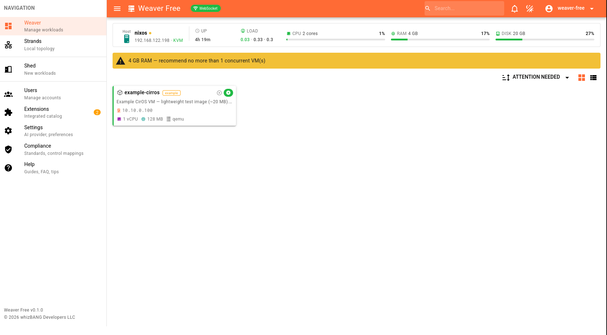
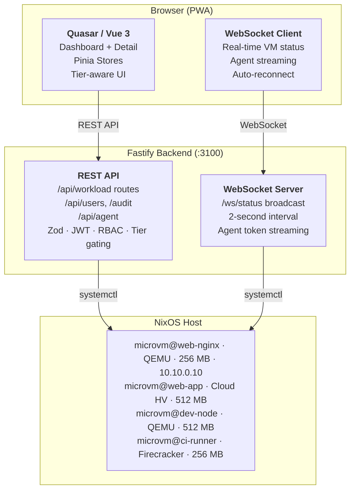

<!-- Copyright (c) 2026 whizBANG Developers LLC. All rights reserved. -->
<!-- Licensed under AGPL-3.0 (Free) or BSL-1.1 (Solo/Team/Fabrick) with AI Training Restriction. See LICENSE. -->
# Weaver



> **Unified container and MicroVM management for NixOS.** Monitor, control, and provision workloads from a modern web interface -- no terminal required.

[-blue.svg)](LICENSE)
[](https://quasar.dev)
[](https://vuejs.org)
[](https://www.typescriptlang.org)
[](https://fastify.dev)
[](https://nixos.org)
[](https://scorecard.dev/viewer/?uri=github.com/whizbangdevelopers-org/Weaver-Free)


[](https://www.bestpractices.dev/projects/12592)

---

## Why Weaver?

Managing [microvm.nix](https://github.com/astro/microvm.nix) VMs through `systemctl` and `journalctl` works, but it doesn't scale. Weaver gives you:

- **Instant visibility** -- WebSocket-driven live status updates every 2 seconds. Start a VM from the terminal, watch the card flip green in the browser.
- **One-click lifecycle** -- Start, stop, restart any MicroVM without touching a terminal.
- **Declarative, reproducible deployment** -- A single NixOS module option. `services.weaver.enable = true;` and you're done.
- **AI-powered diagnostics** -- Diagnose, explain, or get optimization suggestions for any VM. Bring your own API key -- no vendor lock-in.
- **Multi-hypervisor provisioning** -- Create VMs from the browser with QEMU, Cloud Hypervisor, crosvm, kvmtool, or Firecracker.
- **NixOS-native** -- Purpose-built for NixOS. Manages `microvm@<name>.service` units directly with restricted sudo. No agents, no shims.

## Live Demo

Try the full dashboard without installing anything:

**[weaver-dev.github.io](https://weaver-dev.github.io)**

Eight sample VMs across multiple distros (NixOS, Ubuntu, Rocky, Alma, Windows), multiple hypervisors, and all status types. Use the **tier-switcher toolbar** to toggle between Free, Solo, and FabricK feature sets in real time.

## Install

### New to NixOS?

Weaver runs on [NixOS](https://nixos.org) — a Linux distribution where your entire system is defined in a single configuration file. If you're coming from Ubuntu, Debian, or Proxmox, here's what you need to know:

- **NixOS is not installed with `apt` or `yum`.** You download an ISO, boot from it, and run the NixOS installer. The installer creates `/etc/nixos/configuration.nix` — a single file that declares everything about your system (packages, services, users, networking).
- **`nixos-rebuild switch`** is how you apply changes. Edit `configuration.nix`, run `sudo nixos-rebuild switch`, and NixOS builds and activates the new system. If something breaks, reboot and select the previous generation from the boot menu — instant rollback.
- **Weaver installs as a NixOS module.** You add a few lines to `configuration.nix`, rebuild, and Weaver is running. No `apt install`, no Docker required (though Docker is also an option — see below).

**To get started:**
1. Download the NixOS ISO from [nixos.org/download](https://nixos.org/download/#nixos-iso) (select the **Minimal ISO** — no desktop needed, see note below)
2. Install NixOS on bare metal or in a VM ([official install guide](https://nixos.org/manual/nixos/stable/#sec-installation))
3. Once you're at a NixOS shell prompt with internet access, continue with the Prerequisites section below

> **Already have NixOS running?** Skip straight to [Prerequisites](#prerequisites).

### Prerequisites

Before running any install path below, verify your host has the tools each path needs.

**All paths:**
```bash
git --version    # Weaver clones + the flake path need git
```
Install on NixOS: `nix-env -iA nixpkgs.git`, or add `git` to `environment.systemPackages` in your `configuration.nix`.

**NixOS Flake path (below):** flakes must be enabled. Check:
```bash
nix flake --help   # should print usage, not "unknown command"
```
If flakes are disabled, add `nix.settings.experimental-features = [ "nix-command" "flakes" ];` to your `configuration.nix` and rebuild before continuing.

**Docker path (below):** `docker --version` and `docker compose version`.

**Recommended: install `nh` (nix-helper) for store cleanup.** Each `nixos-rebuild` creates a new generation, and the Nix store grows fast when experimenting with Weaver configuration changes. `nh` makes garbage collection simple:

```bash
# Add to environment.systemPackages:
environment.systemPackages = with pkgs; [ git nh ];

# Then clean old generations anytime — keep the 3 most recent as rollback targets:
nh clean all --keep 3
```

> **No desktop environment needed.** Weaver is a web application served on port 3100. Access it from any browser on your network (`http://<host-ip>:3100`). The NixOS host stays headless — during NixOS installation, select **"No desktop"** to keep the footprint small. A desktop (GNOME, KDE, etc.) is unnecessary and wastes resources.
>
> **"Allow unfree software?"** During NixOS installation, the installer asks whether to allow unfree packages. Weaver itself is AGPL-3.0 (Free tier) and does not require unfree software. Select **No** unless you have other software that needs it.
>
> **Disk setup during NixOS install:**
> - **Erase disk** — correct for a fresh install (VM or dedicated host).
> - **Swap** — skip it if you have 8 GB+ RAM. Weaver's backend uses ~200 MB; MicroVMs are the real consumers and perform best in RAM. If tight on memory (4 GB test VM), a 2 GB swap file prevents OOM during `nixos-rebuild` builds.
> - **Hibernate** — select **No**. A Weaver host manages live VMs — hibernation would kill all running MicroVMs.
> - **Encrypt** — skip for test VMs (no benefit, adds unlock complexity). For production, enable LUKS full-disk encryption to protect VM disk images and the Weaver database at rest.
>
> **Installing NixOS in virt-manager?** When creating the VM, virt-manager auto-detects the NixOS ISO and shows **"NixOS Unstable"** in the "Choose the operating system you are installing" field. This is normal — NixOS minimal ISOs are published on the unstable channel even for stable releases. Proceed with the install; your `configuration.nix` controls which NixOS channel (e.g. `nixos-25.11`) you actually run.

### Hostname Convention

We recommend naming your NixOS host after its Weaver tier:

| Tier | Hostname |
|------|----------|
| Free | `weaver-free` |
| Solo | `weaver-solo` |
| Team | `weaver-team` |
| Fabrick | `weaver-fabrick` |

Set it in your `configuration.nix`:

```nix
networking.hostName = "weaver-free";
```

This makes the machine's role obvious in SSH sessions, monitoring, and fleet inventories. For multi-host Fabrick fleets, append a number: `weaver-team-01`, `weaver-team-02`.

### Automated (fastest)

If you have a local clone of this repo and root access on the target host, the install script handles everything:

```bash
sudo ./scripts/nix-install.sh                   # Free tier
sudo ./scripts/nix-install.sh --license-key KEY # Solo/Team/Fabrick
sudo ./scripts/nix-install.sh --dry-run         # preview what it will do
```

The script auto-detects flake vs traditional NixOS configs, shows the plan, asks for confirmation, then edits `/etc/nixos/flake.nix` (or `configuration.nix`), stages git changes, and runs `nixos-rebuild switch`. For manual install, follow the sections below.

### NixOS Flake (recommended, manual)

Three steps: add the flake input, load the module, enable the service.

**Step 1.** Add the Weaver input to your `/etc/nixos/flake.nix`:

```nix
{
  inputs = {
    nixpkgs.url = "github:NixOS/nixpkgs/nixos-25.11";

    # Weaver
    weaver.url = "github:whizbangdevelopers-org/Weaver-Free";
    weaver.inputs.nixpkgs.follows = "nixpkgs";
  };

  outputs = { self, nixpkgs, weaver, ... }@inputs: {
    nixosConfigurations.weaver-free = nixpkgs.lib.nixosSystem {
      system = "x86_64-linux";
      modules = [
        ./configuration.nix
        weaver.nixosModules.default    # ← loads the service definition
      ];
      specialArgs = { inherit inputs; };
    };
  };
}
```

**Step 2.** Enable the service in your `configuration.nix` (or a separate module):

```nix
services.weaver = {
  enable = true;
  # port = 3100;          # default
  # openFirewall = true;  # allow LAN access
};
```

**Step 3.** Stage, rebuild, then commit. `/etc/nixos` is root-owned on a
standard NixOS install, so every `git` command needs `sudo`:

```bash
cd /etc/nixos
sudo git add -A                             # flakes only see staged/committed files
sudo nixos-rebuild switch --flake .#weaver-free
sudo git add flake.lock                     # rebuild updates the lock file
sudo git commit -m "Add weaver"
```

> **Flake gotchas:**
> - Nix flakes only see git-tracked content. If you skip `git add`, the rebuild won't see your changes — including modifications to existing files.
> - The rebuild updates `flake.lock` — commit it afterward to keep your repo clean.
> - If committing as root (`sudo git commit`), git may not know your identity. Either commit as your normal user, use your IDE's git integration, or run: `git config user.email "you@example.com" && git config user.name "Your Name"` in the NixOS repo.

> **First build.** NixOS builds Weaver from source on the first `nixos-rebuild`. This takes a few minutes. Subsequent rebuilds are near-instant thanks to the Nix store cache.

Dashboard available at `http://<host>:3100`. On first visit, create an admin account through the web UI.

**Sample config files** are available in [`nixos/examples/`](nixos/examples/) — copy and adapt for your setup.

### NixOS Traditional (no flakes / air-gapped)

For systems that don't use flakes, import the module via `fetchTarball`:

```nix
# configuration.nix
let
  weaver = builtins.fetchTarball {
    url = "https://github.com/whizbangdevelopers-org/Weaver-Free/archive/v1.0.0.tar.gz";
    sha256 = "0000000000000000000000000000000000000000000000000000";
  };
in
{
  imports = [
    "${weaver}/nixos/default.nix"
  ];

  services.weaver.enable = true;
}
```

For air-gapped systems, download the tarball manually, copy it to the machine, and point to the local path:

```nix
imports = [ "/path/to/weaver/nixos/default.nix" ];
```

Then rebuild with `sudo nixos-rebuild switch` (no `--flake` flag).

> See the [NixOS platform guides](docs/platforms/nixos/) for bridge networking, secrets management, provisioning, and advanced configuration.

### Converting a Traditional NixOS System to Flakes

If you're on a channel-based NixOS and want to switch to flakes (recommended for reproducibility and easier Weaver updates):

1. **Enable the flake experimental features** in your `configuration.nix`:
   ```nix
   nix.settings.experimental-features = [ "nix-command" "flakes" ];
   ```
   Rebuild: `sudo nixos-rebuild switch`

2. **Create `/etc/nixos/flake.nix`**:
   ```nix
   {
     inputs.nixpkgs.url = "github:NixOS/nixpkgs/nixos-25.11";
     outputs = { self, nixpkgs }: {
       nixosConfigurations.weaver-free = nixpkgs.lib.nixosSystem {
         system = "x86_64-linux";
         modules = [ ./configuration.nix ];
       };
     };
   }
   ```

3. **Initialize git** (flakes only see tracked files):
   ```bash
   cd /etc/nixos
   sudo git init
   sudo git add -A
   ```

4. **Rebuild using the flake**:
   ```bash
   sudo nixos-rebuild switch --flake /etc/nixos#weaver-free
   ```

After this, you can follow the **NixOS Flake** install instructions above (or use the automated `nix-install.sh` script).

### Uninstall

```bash
sudo ./scripts/nix-uninstall.sh
```

Stops the service, removes runtime data, and guides you through removing the NixOS configuration. Supports `--keep-data` and `--dry-run`.

### Docker

```bash
git clone https://github.com/whizbangdevelopers-org/Weaver-Free.git
cd Weaver-Free
docker compose up -d
```

Access at `http://localhost:3110`. See [Docker guide](docs/platforms/docker/) for details.

### Dependency Note

> **Do not run `npm audit fix`.** Dependency versions are pinned and security-audited. Modifying `package-lock.json` will break the NixOS build. Vulnerabilities are tracked in the project's security pipeline.

## Compatibility

<!-- SYNC:COMPAT_SUMMARY:START -->
| Platform | Architecture | Provisioning | Status |
|----------|-------------|-------------|--------|
| NixOS 25.11+ bare metal | x86_64 | Full | Supported |
| NixOS 25.11+ VM (cloud/nested) | x86_64 | Nested virt required | Supported |
| NixOS 25.11+ bare metal | aarch64 | Experimental | Community |
| Docker (any Linux) | x86_64 | Dashboard only | Supported |
| Docker (any Linux) | aarch64 | Dashboard only | Community |
<!-- SYNC:COMPAT_SUMMARY:END -->

MicroVM provisioning requires KVM (`/dev/kvm`) and CPU virtualization extensions (Intel VT-x or AMD-V). Device passthrough additionally requires IOMMU (VT-d / AMD-Vi) enabled in BIOS.

**[Full Compatibility Matrix](docs/COMPATIBILITY.md)** -- hardware requirements, BIOS configuration, cloud provider compatibility, and NixOS version support.

**Pre-flight check:** Run `./scripts/preflight-check.sh` before installing to verify hardware readiness.

## Features

### Free Tier

Everything you need to monitor and manage existing MicroVMs.

- **Real-time dashboard** -- WebSocket status cards with grid and compact list views
- **VM lifecycle** -- Start / Stop / Restart from the browser
- **VM scanning** -- Auto-discover `microvm@*.service` units on the host
- **VM detail view** -- Configuration, networking, provisioning logs, and AI analysis tabs
- **AI diagnostics (BYOK)** -- Bring your own API key for AI-powered Diagnose, Explain, and Suggest actions
- **Serial console** -- In-browser terminal via xterm.js with WebSocket-to-TCP proxy
- **Network topology** -- Auto-detected bridge visualization
- **In-app notifications** -- Event bell with history
- **Keyboard shortcuts** -- `?` help, `D` dashboard, `S` settings, `N` notifications
- **PWA** -- Installable progressive web app with mobile-optimized layout
- **Help system** -- Searchable help page, Getting Started wizard, contextual tooltips

### Weaver Solo / Weaver Team

Create and manage VMs, not just monitor them.

- **VM provisioning** -- Create VMs from the UI with cloud-init image pipeline
- **Multi-hypervisor** -- QEMU, Cloud Hypervisor, crosvm, kvmtool, Firecracker
- **Windows support** -- BYOISO with VNC install (IDE disk + e1000 networking, desktop mode)
- **Distribution catalog** -- 11 built-in distros + custom URL definitions with health monitoring
- **Host info strip** -- NixOS version, CPU topology, disk/RAM usage, network interfaces, live metrics
- **Bridge management** -- Create/delete managed bridges and IP pools
- **Push notifications** -- ntfy, email (SMTP), webhook (Slack/Discord/PagerDuty), Web Push
- **Resource alerts** -- Configurable CPU/memory thresholds
- **AI diagnostics** -- Server-managed API key with higher rate limits

### Fabrick

Fleet governance for production environments.

- **Per-VM access control** -- Fine-grained ACLs per user per VM
- **Audit log** -- Queryable API for all VM, user, and agent actions
- **User quotas** -- VM resource limits with enforcement
- **Bulk operations** -- Multi-select start/stop/restart across VMs
- **AI diagnostics** -- Fleet-scale rate limits
- **Priority support**

---

## Architecture



## Network

The dashboard uses a dedicated bridge for VM communication. Defaults work out of the box:

| Setting | Default | Description |
| ------- | ------- | ----------- |
| Bridge interface | `br-microvm` | Linux bridge connecting host to VMs |
| Bridge gateway | `10.10.0.1` | Host IP on the bridge |
| VM subnet | `10.10.0.0/24` | Usable range: `.2` -- `.254` |

Override in your NixOS config if the default subnet conflicts with your network. See [SETUP-COMMON.md](docs/platforms/nixos/SETUP-COMMON.md) for bridge configuration details.

## Tech Stack

| Layer | Technology | Version |
| ---------- | --------------------- | ------- |
| UI Framework | [Quasar](https://quasar.dev) | 2.14+ |
| Frontend | [Vue 3](https://vuejs.org) | 3.5+ |
| Language | [TypeScript](https://typescriptlang.org) | 5.3+ |
| Backend | [Fastify](https://fastify.dev) | 4.x |
| State | [Pinia](https://pinia.vuejs.org) | 2.1+ |
| Validation | [Zod](https://zod.dev) | 3.x |
| Console | [xterm.js](https://xtermjs.org) | 6.x |
| Testing | Vitest / Playwright | -- |
| Platform | [NixOS](https://nixos.org) | 25.11+ |

## Security

Weaver manages VM lifecycle operations on NixOS hosts. Security is not an afterthought:

- **Least privilege** -- Dedicated `weaver` system user with sudo restricted to `microvm@*.service` commands only
- **Input validation** -- All API parameters validated with Zod schemas. VM names restricted to `^[a-z][a-z0-9-]*$`
- **JWT authentication** -- Short-lived access tokens with automatic refresh, bcrypt hashing (OWASP 2024+)
- **Account lockout** -- Progressive lockout on repeated failed attempts, persisted to disk (survives restarts)
- **RBAC** -- Admin / Operator / Viewer roles with backend enforcement
- **Secrets management** -- JWT secret required in production, integrates with sops-nix
- **Supply chain** -- All GitHub Actions SHA-pinned, dependency lockfile verification

See [SECURITY.md](SECURITY.md) for the full security policy and vulnerability reporting.

## Software Quality

Weaver is tested to enterprise standards from day one:

| Dimension | Our Approach | Industry Standard | Rating |
|-----------|--------------|-------------------|--------|
| Test coverage | 1,300+ tests across 4 layers (unit, backend, TUI, E2E) | Wide base, narrow top | A |
| Static analysis | Custom compliance auditors (forms, routes, SAST, tier parity, license, bundle) + lint + typecheck | 1–2 generic tools (lint + type) | A+ |
| E2E isolation | Docker-containerized, seed data, pre-auth, 5 browsers | Docker or CI-managed | A |
| Tier enforcement | Machine-readable feature matrix + bidirectional code scanning | Manual review or none | A+ |
| Gate enforcement | Git hooks + GitHub Actions CI on every push | CI blocks merge | A |
| Security testing | Custom SAST + supply chain SHA pinning + license audit + OWASP patterns | npm audit or Snyk | A |
| Reproducibility | Deterministic Docker E2E + `.nvmrc` + lockfile verification | Hermetic CI containers | A |
| **Overall** | | | **A** |

Weaver maintains enterprise-grade testing and compliance standards across the full development lifecycle.

## Terminal UI (TUI)

A companion terminal client for headless servers and SSH sessions:

```bash
npx weaver-tui --url http://localhost:3100
```

VM list, detail views, and status monitoring from the terminal. Supports `--demo` mode for offline use.

> **Prerequisite:** The TUI connects to the same backend API as the web UI. You must complete the initial admin setup via the web interface (`http://<host>:3100`) before the TUI can authenticate.

> **Psst.** The Help page in the web UI knows things about the TUI that this README doesn't. Go find them.

## Documentation

| Document | Description |
| --- | --- |
| [First Install Guide](docs/platforms/nixos/FIRST-INSTALL.md) | Step-by-step for new NixOS users |
| [NixOS Setup](docs/platforms/nixos/) | Flake and traditional NixOS deployment |
| [Docker Setup](docs/platforms/docker/) | Container-based deployment |
| [Production Deployment](docs/PRODUCTION-DEPLOYMENT.md) | Security checklist, monitoring, backup |
| [Admin Guide](docs/ADMIN-GUIDE.md) | License, network, AI, user management |
| [User Guide](docs/USER-GUIDE.md) | Daily usage, keyboard shortcuts, TUI |
| [Changelog](CHANGELOG.md) | Version history |
| [Compatibility Matrix](docs/COMPATIBILITY.md) | Hardware, platform, and BIOS requirements |
| [Security Policy](SECURITY.md) | Vulnerability reporting |

## Contributing

We welcome contributions. See [CONTRIBUTING.md](CONTRIBUTING.md) for guidelines.

Before submitting a PR:
```bash
npm run test:precommit   # lint + typecheck + unit tests
```

## Attributions

Built on excellent open-source projects:

| Project | Use | License |
|---------|-----|---------|
| [Quasar Framework](https://quasar.dev) | UI component library | MIT |
| [Vue.js](https://vuejs.org) | Frontend framework | MIT |
| [Fastify](https://fastify.dev) | Backend HTTP server | MIT |
| [Pinia](https://pinia.vuejs.org) | State management | MIT |
| [Zod](https://zod.dev) | Schema validation | MIT |
| [xterm.js](https://xtermjs.org) | Terminal emulator | MIT |
| [microvm.nix](https://github.com/astro/microvm.nix) | NixOS MicroVM framework | MIT |
| [Vitest](https://vitest.dev) | Unit testing | MIT |
| [Playwright](https://playwright.dev) | E2E testing | Apache-2.0 |
| [Material Design Icons](https://pictogrammers.com/library/mdi/) | Icon set | Apache-2.0 |

Special thanks to the [NixOS](https://nixos.org) community and [Astro](https://github.com/astro) for making declarative VM management possible.

## License

**Weaver Free** is licensed under AGPL-3.0 with an AI Training Restriction (an AGPL §7 additional term). See [LICENSE](LICENSE).

**Weaver Solo, Weaver Team, and Fabrick** are licensed under BSL-1.1 (Business Source License 1.1). Contact us for details.

The Free tier code is source-available and free to use, modify, and self-host. The restrictions prevent AI model training on this codebase and commercial resale of the software itself. If you're running it on your NixOS box, you're good. Paid tiers convert to AGPL-3.0 four years after each release.

---

Built with [Quasar Framework](https://quasar.dev) and [Fastify](https://fastify.dev). Part of the [WhizBang Developers LLC](https://github.com/whizbangdevelopers-org) ecosystem.
