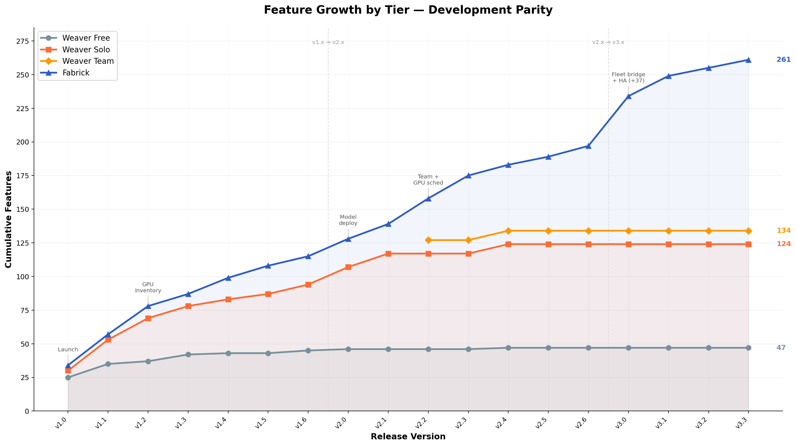
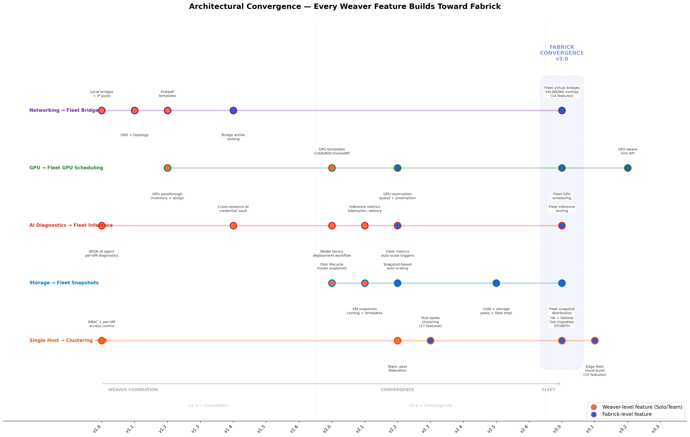

<!-- Copyright (c) 2026 whizBANG Developers LLC. All rights reserved. -->
<!-- Proprietary and confidential. Do not distribute. -->

# Tier Feature Matrix — Internal Review

> **Purpose:** Complete feature inventory per tier showing initial release (v1.0) and final release state.
> **Last updated:** 2026-03-29
> **Status:** DRAFT — internal review only

---

## Feature Growth by Version

Cumulative feature count per tier as each release ships. Demonstrates development parity — every tier grows with every release, not just the top tier.

| Version | Milestone | Free | Solo | Team | Fabrick |
|---------|-----------|:----:|:----:|:----:|:-------:|
| **v1.0** | Production launch | **25** | **30** | — | **34** |
| **v1.1** | Containers + extensions | **35** (+10) | **53** (+23) | — | **57** (+23) |
| **v1.2** | Full container mgmt + GPU | **37** (+2) | **69** (+16) | — | **78** (+21) |
| **v1.3** | Mobile apps | **42** (+5) | **78** (+9) | — | **87** (+9) |
| **v1.4** | Cross-resource AI | **43** (+1) | **83** (+5) | — | **99** (+12) |
| **v1.5** | Secrets management | 43 | **87** (+4) | — | **108** (+9) |
| **v1.6** | Migration tooling | **45** (+2) | **94** (+7) | — | **115** (+7) |
| **v2.0** | Storage + model deployment | **46** (+1) | **107** (+13) | — | **128** (+13) |
| **v2.1** | Snapshots + inference metrics | 46 | **117** (+10) | — | **139** (+11) |
| **v2.2** | **Team tier + GPU scheduling** | 46 | 117 | **127** | **158** (+19) |
| **v2.3** | Fabrick clustering | 46 | 117 | 127 | **175** (+17) |
| **v2.4** | Backup (Weaver) | **47** (+1) | **124** (+7) | **134** (+7) | **183** (+8) |
| **v2.5** | Storage fleet | 47 | 124 | 134 | **189** (+6) |
| **v2.6** | Backup fleet | 47 | 124 | 134 | **197** (+8) |
| **v3.0** | HA + fleet bridge + inference | 47 | 124 | 134 | **234** (+37) |
| **v3.1** | Edge + cloud burst | 47 | 124 | 134 | **249** (+15) |
| **v3.2** | Self-serve billing | 47 | 124 | 134 | **255** (+6) |
| **v3.3** | Compliance pack | 47 | 124 | 134 | **261** (+6) |

### Architectural Convergence

Every Weaver feature is a deliberate building block for Fabrick. Five architectural threads run from v1.0 through v3.0, each starting as a single-host Weaver capability and maturing into fleet-scale Fabrick infrastructure:

1. **Networking → Fleet Bridge** — Local bridges (v1.0) → firewall templates → bridge routing → VXLAN/WireGuard fleet overlay (v3.0)
2. **GPU → Fleet GPU Scheduling** — GPU passthrough (v1.2) → inventory → templates → reservation/queue/preemption (v2.2) → fleet scheduling (v3.0)
3. **AI → Fleet Inference** — BYOK agent (v1.0) → cross-resource AI → model library → inference metrics → fleet inference routing (v3.0)
4. **Storage → Fleet Snapshots** — Disk lifecycle (v2.0) → model snapshots → auto-scaling → CoW pools → fleet snapshot distribution (v3.0)
5. **Single Host → Clustering → HA** — RBAC (v1.0) → peer federation (v2.2) → hub-spoke clustering (v2.3) → HA failover + live migration (v3.0)

**Key observations:**
- Every paid tier ships **2.6–5.6x** the features of Free at maturity (Solo 124, Team 134, Fabrick 261 vs Free 47)
- v1.0–v1.3 is the heaviest build phase across all tiers — **80–90%** of Free's final feature set ships by v1.3
- **v3.0 is the biggest single release** (+37 features) — fleet virtual bridges, fleet inference routing, HA, and live migration all land together
- Fabrick's feature count **doubles** from v2.0 (128) to v3.3 (261) — clustering, bridges, HA, edge, and compliance are the moat
- v2.0 is a major inflection for Solo/Team (+13) — model deployment, snapshot provisioning, and GPU templates arrive
- v2.2 is the Fabrick GPU scheduling gate — reservation, queue, preemption, auto-scaling, and MIG partitioning
- Solo reaches **86%** of its final count by v2.0 — Founding Members get near-complete value fast

### AI-Era Threat Response by Tier

Project Glasswing (April 2026) demonstrated that AI can discover thousands of zero-day vulnerabilities at industrial scale — including bugs that survived decades of human review. Every tier of Weaver provides layered defense against this new threat landscape:

| Capability | Free | Solo | Team | Fabrick | Version |
|-----------|:----:|:----:|:----:|:-------:|:-------:|
| **Hardware isolation per MicroVM** (blast radius = 1 VM, not entire host) | ✓ | ✓ | ✓ | ✓ | v1.0 |
| **NixOS immutability** (deterministic rebuild, atomic rollback) | ✓ | ✓ | ✓ | ✓ | v1.0 |
| **Multi-hypervisor diversity** (5 hypervisors — a hypervisor zero-day affects only workloads on that hypervisor) | ✓ | ✓ | ✓ | ✓ | v1.0 |
| **AppArmor/Seccomp hardening** (per-VM mandatory access control) | — | ✓ | ✓ | ✓ | v1.2 |
| **Firewall templates** (nftables, profile egress control) | — | ✓ | ✓ | ✓ | v1.2 |
| **Covert channel mitigations** (kernel hardening plugins) | — | ✓ | ✓ | ✓ | v1.2 |
| **Zero-downtime patching** (Path B — LP clones + bridge shift during rebuild) | — | — | ✓ | ✓ | v2.1 |
| **Fleet-wide Colmena patching** (one command, all nodes, bit-for-bit identical) | — | — | — | ✓ | v2.3 |
| **Smart Bridges isolation** (auto-drain traffic from compromised nodes) | — | — | — | ✓ | v3.0 |
| **Compliance Export** (prove patch status across 8 regulatory frameworks) | — | — | — | ✓ | v2.2+ |

Shared-kernel architectures (Docker, Podman, Kubernetes pods) have no equivalent to hardware isolation. A single kernel zero-day compromises every workload on the host. With AI discovering vulnerabilities faster than humans can patch them, the cost of *not* having hardware isolation is increasing.

---

## Pricing Summary

| Tier | RAM Limit | Standard Price | FM Price (locked) |
|------|-----------|---------------|-------------------|
| **Weaver Free** | 32 GB | $0 | — |
| **Weaver Solo** | 128 GB | $249/yr (from v1.2) | $149/yr (first 200 or v1.2) |
| **Weaver Team** | 128 GB/host | $199/user/yr (from v2.2) | $129/user/yr (cap v2.2) |
| **Fabrick** | 256–512 GB/node | $2,000→$2,000→$3,500/yr | $1,299/yr (first 20, cap v2.2) |

---

## Weaver Free

| Feature | Initial (v1.0) | Final Release | Version |
|---------|:-:|:-:|:-:|
| **Workload Management** | | | |
| Register & manage existing MicroVMs | ✓ | ✓ | v1.0 |
| Weaver with workload cards (grid + list view) | ✓ | ✓ | v1.0 |
| Workload status badges + WebSocket live updates | ✓ | ✓ | v1.0 |
| Multi-hypervisor selection (QEMU, Cloud Hypervisor, crosvm, kvmtool, Firecracker) | ✓ | ✓ | v1.0 |
| Windows guest support (guestOs field, ISO-install path) | ✓ | ✓ | v1.0 |
| Curated distro catalog (NixOS, CirrOS, Rocky, Alma, openSUSE) | ✓ | ✓ | v1.0 |
| Workload tags (organize VMs and containers) | ✓ | ✓ | v1.0 |
| Docker/Podman container visibility (read-only cards, detail, logs) | — | ✓ | v1.1 |
| Container runtime auto-detection | — | ✓ | v1.1 |
| Weaver combined resource stats (VMs + containers) | — | ✓ | v1.4 |
| Dockerfile parser → dual output (Nix VM or Apptainer SIF) | — | ✓ | v1.6 |
| docker-compose/podman-compose parser → Nix config | — | ✓ | v1.6 |
| **Monitoring & Observability** | | | |
| Real-time workload status via WebSocket | ✓ | ✓ | v1.0 |
| Serial console viewer (xterm.js) | ✓ | ✓ | v1.0 |
| Provisioning logs (async progress stream) | ✓ | ✓ | v1.0 |
| VM resource monitoring graphs (1-hour ring buffer) | — | ✓ | v1.1 |
| Service health probes (TCP/HTTP checks) | — | ✓ | v1.1 |
| Container logs and inspect view | — | ✓ | v1.1 |
| **AI Diagnostics** | | | |
| AI agent — per-VM diagnostics with markdown streaming | ✓ | ✓ | v1.0 |
| BYOK (Bring Your Own Key) — Anthropic Claude | ✓ | ✓ | v1.0 |
| BYOV (Bring Your Own Vendor) — pluggable provider architecture | ✓ | ✓ | v1.0 |
| Mock agent fallback (works without API key) | ✓ | ✓ | v1.0 |
| AI Settings: vendor selection, API key input | ✓ | ✓ | v1.0 |
| AI infrastructure protection: 5 requests/min (protects API spend, GPU compute, or host resources) | ✓ | ✓ | v1.0 |
| **Authentication & Security** | | | |
| Session auth (cookie-based, bcrypt passwords, SQLite) | ✓ | ✓ | v1.0 |
| Three-role RBAC (admin / operator / viewer) | ✓ | ✓ | v1.0 |
| TOTP via 1Password Technology Alliance (free) | — | ✓ | v1.1 |
| FIDO2 via Yubico Technology Alliance (free) | — | ✓ | v1.1 |
| **Networking** | | | |
| Topology visualization (Strands page) | — | ✓ | v1.1 |
| Tailscale setup wizard | — | ✓ | v1.2 |
| Network tunnel status detection + re-run wizard | — | ✓ | v1.3 |
| **Mobile & Client** | | | |
| TUI client (React/Ink, 97% web parity) | ✓ | ✓ | v1.0 |
| Keyboard shortcuts | ✓ | ✓ | v1.0 |
| Native Android app (Quasar Capacitor) | — | ✓ | v1.3 |
| Native iOS app | — | ✓ | v1.3.x |
| Mobile-optimized layouts (dashboard, list, detail) | — | ✓ | v1.3 |
| Biometric auth (Face ID / fingerprint) | — | ✓ | v1.3 |
| **Platform** | | | |
| NixOS module (declarative host integration) | ✓ | ✓ | v1.0 |
| NixOS flake support | ✓ | ✓ | v1.0 |
| Demo site (GitHub Pages, tier-switcher) | ✓ | ✓ | v1.0 |
| Help system + Getting Started wizard | ✓ | ✓ | v1.0 |
| Host Config viewer (Settings > Host Config) | ✓ | ✓ | v1.0 |
| nix-ld support (unpatched binaries) | — | ✓ | v1.1 |
| Config export (JSON via API) | — | ✓ | v1.1 |
| Sector personalization (first-run dropdown) | — | ✓ | v1.2 |
| i18n / multi-language foundation | — | ✓ | v2.0 |
| Config export UI | — | ✓ | v2.4 |

---

## Weaver Solo

| Feature | Initial (v1.0) | Final Release | Version |
|---------|:-:|:-:|:-:|
| **Workload Management** | | | |
| Live Provisioning (create/delete VMs without nixos-rebuild) | ✓ | ✓ | v1.0 |
| Distro mutations (add/delete/refresh/URL management) | ✓ | ✓ | v1.0 |
| Create/delete managed bridges + IP pools | ✓ | ✓ | v1.0 |
| Register & manage existing MicroVMs | ✓ | ✓ | v1.0 |
| Weaver with workload cards (grid + list view) | ✓ | ✓ | v1.0 |
| Workload status badges + WebSocket live updates | ✓ | ✓ | v1.0 |
| Multi-hypervisor selection (QEMU, Cloud Hypervisor, crosvm, kvmtool, Firecracker) | ✓ | ✓ | v1.0 |
| Windows guest support (guestOs field, ISO-install path) | ✓ | ✓ | v1.0 |
| Curated distro catalog (NixOS, CirrOS, Rocky, Alma, openSUSE) | ✓ | ✓ | v1.0 |
| Workload tags | ✓ | ✓ | v1.0 |
| Windows UEFI/OVMF + VirtIO drivers ISO | — | ✓ | v1.1 |
| Docker/Podman container visibility (cards, detail, logs) | — | ✓ | v1.1 |
| Apptainer visibility (HPC/research runtime) | — | ✓ | v1.1 |
| Container runtime auto-detection | — | ✓ | v1.1 |
| Docker/Podman management actions (start/stop/create/pull) | — | ✓ | v1.2 |
| Apptainer start/stop/restart + SIF pull/build from OCI | — | ✓ | v1.2 |
| Container creation dialog (SIF or OCI, runtime selector) | — | ✓ | v1.2 |
| GPU passthrough (--nv NVIDIA, --rocm AMD) | — | ✓ | v1.2 |
| GPU inventory detection (vendor, model, VRAM, temp, driver) | — | ✓ | v1.2 |
| GPU assignment — manual pick from inventory | — | ✓ | v1.2 |
| GPU assignment — best-fit auto-pick (highest free VRAM) | — | ✓ | v1.2 |
| GPU assignment — all linked GPUs (multi-GPU for large models) | — | ✓ | v1.2 |
| Windows autounattend.xml injection | — | ✓ | v1.2 |
| Weaver combined resource stats | — | ✓ | v1.4 |
| Dockerfile → dual output (Nix VM or Apptainer SIF) | — | ✓ | v1.6 |
| docker-compose/podman-compose parser → Nix config | — | ✓ | v1.6 |
| **Monitoring & Observability** | | | |
| Real-time workload status via WebSocket | ✓ | ✓ | v1.0 |
| Serial console viewer (xterm.js) | ✓ | ✓ | v1.0 |
| Provisioning logs (async progress stream) | ✓ | ✓ | v1.0 |
| VM resource monitoring graphs (1-hour ring buffer) | — | ✓ | v1.1 |
| VM resource monitoring — 24h+ retention | — | ✓ | v1.1 |
| Service health probes (TCP/HTTP checks) | — | ✓ | v1.1 |
| Container logs and inspect view | — | ✓ | v1.1 |
| GPU telemetry (utilization %, VRAM, temp, power, clock) | — | ✓ | v1.2 |
| Inference metrics (latency p50/p95/p99, tokens/sec, queue depth) | — | ✓ | v2.1 |
| Auto-restart on VRAM OOM | — | ✓ | v2.1 |
| **AI Diagnostics** | | | |
| AI agent — per-VM diagnostics with markdown streaming | ✓ | ✓ | v1.0 |
| BYOK (Bring Your Own Key) — Anthropic Claude | ✓ | ✓ | v1.0 |
| BYOV (Bring Your Own Vendor) — pluggable provider architecture | ✓ | ✓ | v1.0 |
| Mock agent fallback (works without API key) | ✓ | ✓ | v1.0 |
| AI Settings: vendor selection, API key input | ✓ | ✓ | v1.0 |
| OpenAI, Ollama, ZenCoder, Custom providers | ✓ | ✓ | v1.0 |
| Profile switching (multiple AI configs) | ✓ | ✓ | v1.0 |
| AI infrastructure protection: 10 requests/min (protects API spend, GPU compute, or host resources) | ✓ | ✓ | v1.0 |
| VM + container context injection in AI prompts | — | ✓ | v1.4 |
| Cross-resource diagnostics ("why can't container X reach VM Y?") | — | ✓ | v1.4 |
| Unified search across VMs and containers | — | ✓ | v1.4 |
| AI credential vault (SQLCipher + sops-nix) | — | ✓ | v1.4 |
| **Model Deployment & Inference** | | | |
| Model library in Shed (registry of model references) | — | ✓ | v2.0 |
| Model status lifecycle (testing → staging → production) | — | ✓ | v2.0 |
| Single-host model deployment workflow (7-step) | — | ✓ | v2.0 |
| Model version metadata + audit trail | — | ✓ | v2.0 |
| Auto-snapshot on successful inference health check | — | ✓ | v2.0 |
| Restore from model snapshot in Shed | — | ✓ | v2.0 |
| Snapshot version tagging + pruning policy | — | ✓ | v2.0 |
| Memory snapshot — QEMU warm restore (2–5 sec) | — | ✓ | v2.0 |
| Disk snapshot — OS + model weights + config | — | ✓ | v2.0 |
| **Authentication & Security** | | | |
| Session auth (cookie-based, bcrypt passwords, SQLite) | ✓ | ✓ | v1.0 |
| Three-role RBAC (admin / operator / viewer) | ✓ | ✓ | v1.0 |
| TOTP MFA (included in tier) | — | ✓ | v1.1 |
| TOTP via 1Password Technology Alliance | — | ✓ | v1.1 |
| FIDO2 / YubiKey support (included in tier) | — | ✓ | v1.1 |
| FIDO2 via Yubico Technology Alliance | — | ✓ | v1.1 |
| **Networking** | | | |
| Topology visualization (Strands page) | — | ✓ | v1.1 |
| Orthogonal elbow edge routing | — | ✓ | v1.1 |
| DNS extension (dnsmasq + CoreDNS, .vm.internal) | — | ✓ | v1.1 |
| Encrypted DNS resolver (DNSSEC, DoH/DoT) | — | ✓ | v1.1 |
| Firewall templates (nftables, profile egress) | — | ✓ | v1.2 |
| Hardening plugins (AppArmor, Seccomp, Kernel) | — | ✓ | v1.2 |
| Tailscale setup wizard | — | ✓ | v1.2 |
| WireGuard setup wizard (self-hosted, air-gap friendly) | — | ✓ | v1.3 |
| Network Isolation Mode (toggle disables tunnel) | — | ✓ | v1.3 |
| Network tunnel status detection + re-run wizard | — | ✓ | v1.3 |
| **Mobile & Client** | | | |
| TUI client (React/Ink, 97% web parity) | ✓ | ✓ | v1.0 |
| Keyboard shortcuts | ✓ | ✓ | v1.0 |
| Native Android app | — | ✓ | v1.3 |
| Native iOS app | — | ✓ | v1.3.x |
| Mobile-optimized layouts | — | ✓ | v1.3 |
| Biometric auth (Face ID / fingerprint) | — | ✓ | v1.3 |
| Push notifications (VM state, resource alerts) | — | ✓ | v1.3 |
| Deep links for VM actions from notifications | — | ✓ | v1.3 |
| **Secrets Management** | | | |
| General workload secrets (DB passwords, tokens) | — | ✓ | v1.5 |
| Secrets injection at workload boot (env vars, files) | — | ✓ | v1.5 |
| Settings UI for credential vault management | — | ✓ | v1.5 |
| Injection audit trail | — | ✓ | v1.5 |
| **Import / Export / Migration** | | | |
| VM + container config export (.tar.gz) | — | ✓ | v1.6 |
| Config import with preview/dry-run | — | ✓ | v1.6 |
| Proxmox .conf → Nix generation | — | ✓ | v1.6 |
| Libvirt XML → Nix generation | — | ✓ | v1.6 |
| Import orchestrator (detect → parse → preview) | — | ✓ | v1.6 |
| **Storage & Templates** | | | |
| Disk lifecycle (create, attach, detach, resize) | — | ✓ | v2.0 |
| Disk hotplug (attach/detach without VM restart) | — | ✓ | v2.0 |
| Built-in cloud-init templates | — | ✓ | v2.0 |
| Cloud-init userdata editor | — | ✓ | v1.2 |
| SSH key management | — | ✓ | v1.2 |
| Disk snapshots (create, list, restore, delete) | — | ✓ | v2.1 |
| VM cloning (full clone from running or stopped VM) | — | ✓ | v2.1 |
| Save-as-template workflow | — | ✓ | v2.1 |
| Template library + YAML cloud-init editor | — | ✓ | v2.1 |
| Nix template editor (visual module composition) | — | ✓ | v2.1 |
| Host Maintenance Manager: Nix store GC, generation mgmt | — | ✓ | v2.1 |
| TPM support (swtpm) for Windows 11 | — | ✓ | v2.1 |
| cloudbase-init (Windows cloud-init) | — | ✓ | v2.1 |
| **Backup & Recovery** | | | |
| Backup job definition (schedule, target, retention) | — | ✓ | v2.4 |
| BackupAdapter interface (pluggable backends) | — | ✓ | v2.4 |
| Local filesystem backup adapter | — | ✓ | v2.4 |
| NFS backup adapter | — | ✓ | v2.4 |
| Disk backup + restore (full VM images) | — | ✓ | v2.4 |
| Backup job history + status UI | — | ✓ | v2.4 |
| Restore workflow | — | ✓ | v2.4 |
| **Platform** | | | |
| NixOS module (declarative host integration) | ✓ | ✓ | v1.0 |
| NixOS flake support | ✓ | ✓ | v1.0 |
| Demo site | ✓ | ✓ | v1.0 |
| Help system + Getting Started wizard | ✓ | ✓ | v1.0 |
| Host Config viewer | ✓ | ✓ | v1.0 |
| nix-ld support | — | ✓ | v1.1 |
| Config export (JSON via API) | — | ✓ | v1.1 |
| Stripe license infrastructure | — | ✓ | v1.1 |
| API documentation (OpenAPI) | — | ✓ | v1.1 |
| Integrated Extensions system (requirePlugin()) | — | ✓ | v1.1 |
| nixos-generators (export VM as 12 image formats) | — | ✓ | v1.1 |
| home-manager integration in VM templates | — | ✓ | v1.1 |
| Sector personalization | — | ✓ | v1.2 |
| i18n / multi-language foundation | — | ✓ | v2.0 |

---

## Weaver Team

Ships at v2.2. Initial = v2.2 (all Solo features already available at that point).

| Feature | Initial (v2.2) | Final Release | Version |
|---------|:-:|:-:|:-:|
| **Workload Management** | | | |
| Live Provisioning (create/delete VMs without nixos-rebuild) | ✓ | ✓ | v1.0 |
| Distro mutations (add/delete/refresh/URL management) | ✓ | ✓ | v1.0 |
| Create/delete managed bridges + IP pools | ✓ | ✓ | v1.0 |
| Register & manage existing MicroVMs | ✓ | ✓ | v1.0 |
| Weaver with workload cards (grid + list view) | ✓ | ✓ | v1.0 |
| Workload status badges + WebSocket live updates | ✓ | ✓ | v1.0 |
| Multi-hypervisor selection (QEMU, Cloud Hypervisor, crosvm, kvmtool, Firecracker) | ✓ | ✓ | v1.0 |
| Windows guest support (guestOs field, ISO-install path) | ✓ | ✓ | v1.0 |
| Curated distro catalog (NixOS, CirrOS, Rocky, Alma, openSUSE) | ✓ | ✓ | v1.0 |
| Workload tags | ✓ | ✓ | v1.0 |
| Windows UEFI/OVMF + VirtIO drivers ISO | ✓ | ✓ | v1.1 |
| Docker/Podman container visibility (cards, detail, logs) | ✓ | ✓ | v1.1 |
| Apptainer visibility (HPC/research runtime) | ✓ | ✓ | v1.1 |
| Container runtime auto-detection | ✓ | ✓ | v1.1 |
| Docker/Podman management actions (start/stop/create/pull) | ✓ | ✓ | v1.2 |
| Apptainer start/stop/restart + SIF pull/build from OCI | ✓ | ✓ | v1.2 |
| Container creation dialog (SIF or OCI, runtime selector) | ✓ | ✓ | v1.2 |
| GPU passthrough (--nv NVIDIA, --rocm AMD) | ✓ | ✓ | v1.2 |
| GPU inventory detection (vendor, model, VRAM, temp, driver) | ✓ | ✓ | v1.2 |
| GPU assignment — manual pick from inventory | ✓ | ✓ | v1.2 |
| GPU assignment — best-fit auto-pick (highest free VRAM) | ✓ | ✓ | v1.2 |
| GPU assignment — all linked GPUs (multi-GPU for large models) | ✓ | ✓ | v1.2 |
| Windows autounattend.xml injection | ✓ | ✓ | v1.2 |
| Weaver combined resource stats | ✓ | ✓ | v1.4 |
| Dockerfile → dual output (Nix VM or Apptainer SIF) | ✓ | ✓ | v1.6 |
| docker-compose/podman-compose parser → Nix config | ✓ | ✓ | v1.6 |
| **Monitoring & Observability** | | | |
| Real-time workload status via WebSocket | ✓ | ✓ | v1.0 |
| Serial console viewer (xterm.js) | ✓ | ✓ | v1.0 |
| Provisioning logs (async progress stream) | ✓ | ✓ | v1.0 |
| VM resource monitoring graphs (1-hour ring buffer) | ✓ | ✓ | v1.1 |
| VM resource monitoring — 24h+ retention | ✓ | ✓ | v1.1 |
| Service health probes (TCP/HTTP checks) | ✓ | ✓ | v1.1 |
| Container logs and inspect view | ✓ | ✓ | v1.1 |
| GPU telemetry (utilization %, VRAM, temp, power, clock) | ✓ | ✓ | v1.2 |
| Inference metrics (latency p50/p95/p99, tokens/sec, queue depth) | ✓ | ✓ | v2.1 |
| Auto-restart on VRAM OOM | ✓ | ✓ | v2.1 |
| **AI Diagnostics** | | | |
| AI agent — per-VM diagnostics with markdown streaming | ✓ | ✓ | v1.0 |
| BYOK (Bring Your Own Key) — Anthropic Claude | ✓ | ✓ | v1.0 |
| BYOV (Bring Your Own Vendor) — pluggable provider architecture | ✓ | ✓ | v1.0 |
| Mock agent fallback (works without API key) | ✓ | ✓ | v1.0 |
| AI Settings: vendor selection, API key input | ✓ | ✓ | v1.0 |
| OpenAI, Ollama, ZenCoder, Custom providers | ✓ | ✓ | v1.0 |
| Profile switching (multiple AI configs) | ✓ | ✓ | v1.0 |
| AI infrastructure protection: 10 requests/min default + per-user configurable limits (admin-set capacity ceilings) | ✓ | ✓ | v1.0 |
| VM + container context injection in AI prompts | ✓ | ✓ | v1.4 |
| Cross-resource diagnostics ("why can't container X reach VM Y?") | ✓ | ✓ | v1.4 |
| Unified search across VMs and containers | ✓ | ✓ | v1.4 |
| AI credential vault (SQLCipher + sops-nix) | ✓ | ✓ | v1.4 |
| AI Blue/Green Workflow (clone → configure → test → shift bridge weight → confirm/rollback) | ✓ | ✓ | v2.2 |
| **Model Deployment & Inference** | | | |
| Model library in Shed (registry of model references) | ✓ | ✓ | v2.0 |
| Model status lifecycle (testing → staging → production) | ✓ | ✓ | v2.0 |
| Single-host model deployment workflow (7-step) | ✓ | ✓ | v2.0 |
| Model version metadata + audit trail | ✓ | ✓ | v2.0 |
| Auto-snapshot on successful inference health check | ✓ | ✓ | v2.0 |
| Restore from model snapshot in Shed | ✓ | ✓ | v2.0 |
| Snapshot version tagging + pruning policy | ✓ | ✓ | v2.0 |
| Memory snapshot — QEMU warm restore (2–5 sec) | ✓ | ✓ | v2.0 |
| Disk snapshot — OS + model weights + config | ✓ | ✓ | v2.0 |
| **Authentication & Security** | | | |
| Session auth (cookie-based, bcrypt passwords, SQLite) | ✓ | ✓ | v1.0 |
| Three-role RBAC (admin / operator / viewer) | ✓ | ✓ | v1.0 |
| TOTP MFA (included in tier) | ✓ | ✓ | v1.1 |
| TOTP via 1Password Technology Alliance | ✓ | ✓ | v1.1 |
| FIDO2 / YubiKey support (included in tier) | ✓ | ✓ | v1.1 |
| FIDO2 via Yubico Technology Alliance | ✓ | ✓ | v1.1 |
| **Multi-User & Peer Federation** | | | |
| Multi-user support (2–4 paid users + 1 viewer free) | ✓ | ✓ | v2.2 |
| User management (Users page) | ✓ | ✓ | v2.2 |
| Remote workload management (full management, up to 2 peer hosts) | ✓ | ✓ | v2.2 |
| Peer Weaver discovery (Tailscale MagicDNS + manual IP) | ✓ | ✓ | v2.2 |
| Host badge on remote workloads | ✓ | ✓ | v2.2 |
| REST + WebSocket peer protocol | ✓ | ✓ | v2.2 |
| Peer health indicator | ✓ | ✓ | v2.2 |
| Upgrade prompt on peer limit reached | ✓ | ✓ | v2.2 |
| License key: WVR-WVT-* | ✓ | ✓ | v2.2 |
| **Networking** | | | |
| Topology visualization (Strands page) | ✓ | ✓ | v1.1 |
| Orthogonal elbow edge routing | ✓ | ✓ | v1.1 |
| DNS extension (dnsmasq + CoreDNS, .vm.internal) | ✓ | ✓ | v1.1 |
| Encrypted DNS resolver (DNSSEC, DoH/DoT) | ✓ | ✓ | v1.1 |
| Firewall templates (nftables, profile egress) | ✓ | ✓ | v1.2 |
| Hardening plugins (AppArmor, Seccomp, Kernel) | ✓ | ✓ | v1.2 |
| Tailscale setup wizard | ✓ | ✓ | v1.2 |
| WireGuard setup wizard (self-hosted, air-gap friendly) | ✓ | ✓ | v1.3 |
| Network Isolation Mode (toggle disables tunnel) | ✓ | ✓ | v1.3 |
| Network tunnel status detection + re-run wizard | ✓ | ✓ | v1.3 |
| **Mobile & Client** | | | |
| TUI client (React/Ink, 97% web parity) | ✓ | ✓ | v1.0 |
| Keyboard shortcuts | ✓ | ✓ | v1.0 |
| Native Android app | ✓ | ✓ | v1.3 |
| Native iOS app | ✓ | ✓ | v1.3.x |
| Mobile-optimized layouts | ✓ | ✓ | v1.3 |
| Biometric auth (Face ID / fingerprint) | ✓ | ✓ | v1.3 |
| Push notifications (VM state, resource alerts) | ✓ | ✓ | v1.3 |
| Deep links for VM actions from notifications | ✓ | ✓ | v1.3 |
| **Secrets Management** | | | |
| General workload secrets (DB passwords, tokens) | ✓ | ✓ | v1.5 |
| Secrets injection at workload boot (env vars, files) | ✓ | ✓ | v1.5 |
| Settings UI for credential vault management | ✓ | ✓ | v1.5 |
| Injection audit trail | ✓ | ✓ | v1.5 |
| **Import / Export / Migration** | | | |
| VM + container config export (.tar.gz) | ✓ | ✓ | v1.6 |
| Config import with preview/dry-run | ✓ | ✓ | v1.6 |
| Proxmox .conf → Nix generation | ✓ | ✓ | v1.6 |
| Libvirt XML → Nix generation | ✓ | ✓ | v1.6 |
| Import orchestrator (detect → parse → preview) | ✓ | ✓ | v1.6 |
| **Storage & Templates** | | | |
| Disk lifecycle (create, attach, detach, resize) | ✓ | ✓ | v2.0 |
| Disk hotplug (attach/detach without VM restart) | ✓ | ✓ | v2.0 |
| Built-in cloud-init templates | ✓ | ✓ | v2.0 |
| Cloud-init userdata editor | ✓ | ✓ | v1.2 |
| SSH key management | ✓ | ✓ | v1.2 |
| Disk snapshots (create, list, restore, delete) | ✓ | ✓ | v2.1 |
| VM cloning (full clone from running or stopped VM) | ✓ | ✓ | v2.1 |
| Save-as-template workflow | ✓ | ✓ | v2.1 |
| Template library + YAML cloud-init editor | ✓ | ✓ | v2.1 |
| Nix template editor (visual module composition) | ✓ | ✓ | v2.1 |
| Host Maintenance Manager: Nix store GC, generation mgmt | ✓ | ✓ | v2.1 |
| TPM support (swtpm) for Windows 11 | ✓ | ✓ | v2.1 |
| cloudbase-init (Windows cloud-init) | ✓ | ✓ | v2.1 |
| **Backup & Recovery** | | | |
| Backup job definition (schedule, target, retention) | — | ✓ | v2.4 |
| BackupAdapter interface (pluggable backends) | — | ✓ | v2.4 |
| Local filesystem backup adapter | — | ✓ | v2.4 |
| NFS backup adapter | — | ✓ | v2.4 |
| Disk backup + restore (full VM images) | — | ✓ | v2.4 |
| Backup job history + status UI | — | ✓ | v2.4 |
| Restore workflow | — | ✓ | v2.4 |
| **Platform** | | | |
| NixOS module (declarative host integration) | ✓ | ✓ | v1.0 |
| NixOS flake support | ✓ | ✓ | v1.0 |
| Demo site | ✓ | ✓ | v1.0 |
| Help system + Getting Started wizard | ✓ | ✓ | v1.0 |
| Host Config viewer | ✓ | ✓ | v1.0 |
| nix-ld support | ✓ | ✓ | v1.1 |
| Config export (JSON via API) | ✓ | ✓ | v1.1 |
| Stripe license infrastructure | ✓ | ✓ | v1.1 |
| API documentation (OpenAPI) | ✓ | ✓ | v1.1 |
| Integrated Extensions system (requirePlugin()) | ✓ | ✓ | v1.1 |
| nixos-generators (export VM as 12 image formats) | ✓ | ✓ | v1.1 |
| home-manager integration in VM templates | ✓ | ✓ | v1.1 |
| Sector personalization | ✓ | ✓ | v1.2 |
| i18n / multi-language foundation | ✓ | ✓ | v2.0 |

---

## Fabrick

| Feature | Initial (v1.0) | Final Release | Version |
|---------|:-:|:-:|:-:|
| **Workload Management** | | | |
| Live Provisioning (create/delete VMs without nixos-rebuild) | ✓ | ✓ | v1.0 |
| Distro mutations (add/delete/refresh/URL management) | ✓ | ✓ | v1.0 |
| Create/delete managed bridges + IP pools | ✓ | ✓ | v1.0 |
| Register & manage existing MicroVMs | ✓ | ✓ | v1.0 |
| Weaver with workload cards (grid + list view) | ✓ | ✓ | v1.0 |
| Workload status badges + WebSocket live updates | ✓ | ✓ | v1.0 |
| Multi-hypervisor selection (QEMU, Cloud Hypervisor, crosvm, kvmtool, Firecracker) | ✓ | ✓ | v1.0 |
| Windows guest support (guestOs field, ISO-install path) | ✓ | ✓ | v1.0 |
| Curated distro catalog (NixOS, CirrOS, Rocky, Alma, openSUSE) | ✓ | ✓ | v1.0 |
| Workload tags | ✓ | ✓ | v1.0 |
| Windows UEFI/OVMF + VirtIO drivers ISO | — | ✓ | v1.1 |
| Docker/Podman container visibility (cards, detail, logs) | — | ✓ | v1.1 |
| Apptainer visibility (HPC/research runtime) | — | ✓ | v1.1 |
| Container runtime auto-detection | — | ✓ | v1.1 |
| Docker/Podman management actions (start/stop/create/pull) | — | ✓ | v1.2 |
| Apptainer start/stop/restart + SIF pull/build from OCI | — | ✓ | v1.2 |
| Container creation dialog (SIF or OCI, runtime selector) | — | ✓ | v1.2 |
| GPU passthrough (--nv NVIDIA, --rocm AMD) | — | ✓ | v1.2 |
| GPU inventory detection (vendor, model, VRAM, temp, driver) | — | ✓ | v1.2 |
| GPU assignment — manual pick from inventory | — | ✓ | v1.2 |
| GPU assignment — best-fit auto-pick (highest free VRAM) | — | ✓ | v1.2 |
| GPU assignment — all linked GPUs (multi-GPU for large models) | — | ✓ | v1.2 |
| Windows autounattend.xml injection | — | ✓ | v1.2 |
| Weaver combined resource stats | — | ✓ | v1.4 |
| Dockerfile → dual output (Nix VM or Apptainer SIF) | — | ✓ | v1.6 |
| docker-compose/podman-compose parser → Nix config | — | ✓ | v1.6 |
| **Monitoring & Observability** | | | |
| Real-time workload status via WebSocket | ✓ | ✓ | v1.0 |
| Serial console viewer (xterm.js) | ✓ | ✓ | v1.0 |
| Provisioning logs (async progress stream) | ✓ | ✓ | v1.0 |
| VM resource monitoring graphs (1-hour ring buffer) | — | ✓ | v1.1 |
| VM resource monitoring — 24h+ retention | — | ✓ | v1.1 |
| Service health probes (TCP/HTTP checks) | — | ✓ | v1.1 |
| Container logs and inspect view | — | ✓ | v1.1 |
| GPU telemetry (utilization %, VRAM, temp, power, clock) | — | ✓ | v1.2 |
| Inference metrics (latency p50/p95/p99, tokens/sec, queue depth) | — | ✓ | v2.1 |
| Auto-restart on VRAM OOM | — | ✓ | v2.1 |
| Fleet-bridge aggregated inference metrics | — | ✓ | v2.2 |
| Per-workload-group GPU utilization (reserved vs actual) | — | ✓ | v2.2 |
| Set point auto-scaling triggers on inference metrics | — | ✓ | v2.2 |
| Cross-host GPU topology map | — | ✓ | v3.0 |
| Fleet model version tracking + rollout progress | — | ✓ | v3.0 |
| Historical inference metrics (capacity planning) | — | ✓ | v3.0 |
| **AI Diagnostics** | | | |
| AI agent — per-VM diagnostics with markdown streaming | ✓ | ✓ | v1.0 |
| BYOK (Bring Your Own Key) — Anthropic Claude | ✓ | ✓ | v1.0 |
| BYOV (Bring Your Own Vendor) — pluggable provider architecture | ✓ | ✓ | v1.0 |
| Mock agent fallback (works without API key) | ✓ | ✓ | v1.0 |
| AI Settings: vendor selection, API key input | ✓ | ✓ | v1.0 |
| OpenAI, Ollama, ZenCoder, Custom providers | ✓ | ✓ | v1.0 |
| Profile switching (multiple AI configs) | ✓ | ✓ | v1.0 |
| AI infrastructure protection: 30 requests/min default + fleet-wide per-user configurable limits (admin-set capacity ceilings across all nodes) | ✓ | ✓ | v1.0 |
| VM + container context injection in AI prompts | — | ✓ | v1.4 |
| Cross-resource diagnostics ("why can't container X reach VM Y?") | — | ✓ | v1.4 |
| Unified search across VMs and containers | — | ✓ | v1.4 |
| AI credential vault (SQLCipher + sops-nix) | — | ✓ | v1.4 |
| Cross-resource AI diagnostics (VMs + containers together) | — | ✓ | v1.4 |
| Policy routing (AI provider selection per workload) | — | ✓ | v1.4 |
| Agent-suggested resource placement | — | ✓ | v1.4 |
| Resource dependency mapping | — | ✓ | v1.4 |
| Bridge active routing (Decision #112) | — | ✓ | v1.4 |
| Per-resource-type vendor controls (HIPAA, air-gap mapping) | — | ✓ | v1.4 |
| AI Blue/Green Workflow (clone → configure → test → shift bridge weight → confirm/rollback) | — | ✓ | v2.2 |
| **Model Deployment & Inference** | | | |
| Model library in Shed (registry of model references) | — | ✓ | v2.0 |
| Model status lifecycle (testing → staging → production) | — | ✓ | v2.0 |
| Single-host model deployment workflow (7-step) | — | ✓ | v2.0 |
| Model version metadata + audit trail | — | ✓ | v2.0 |
| Auto-snapshot on successful inference health check | — | ✓ | v2.0 |
| Restore from model snapshot in Shed | — | ✓ | v2.0 |
| Snapshot version tagging + pruning policy | — | ✓ | v2.0 |
| Memory snapshot — QEMU warm restore (2–5 sec) | — | ✓ | v2.0 |
| Disk snapshot — OS + model weights + config | — | ✓ | v2.0 |
| Model access control (per-workload-group) | — | ✓ | v2.2 |
| GPU reservation (per-workload-group guaranteed allocation) | — | ✓ | v2.2 |
| GPU queue (FIFO or priority-based wait) | — | ✓ | v2.2 |
| GPU preemption (evict lower-priority workload) | — | ✓ | v2.2 |
| Multi-GPU topology-aware assignment (NUMA affinity) | — | ✓ | v2.2 |
| Container GPU (NVIDIA MIG partitioning, AMD exclusive) | — | ✓ | v2.2 |
| Snapshot-based auto-scaling (restore on set point trigger) | — | ✓ | v2.2 |
| Fleet model deployment (hub selects host) | — | ✓ | v3.0 |
| Fleet model cache/snapshot awareness | — | ✓ | v3.0 |
| Fleet blue/green coordinated across hosts | — | ✓ | v3.0 |
| Fleet snapshot distribution (proactive cache warming) | — | ✓ | v3.0 |
| Fleet GPU scheduling (cross-host placement) | — | ✓ | v3.0 |
| **Fleet Virtual Bridge (Overlay Network)** | | | |
| Fleet virtual bridge architecture (VXLAN datacenter overlay) | — | ✓ | v3.0 |
| WireGuard overlay (edge/remote fleet transport) | — | ✓ | v3.0 |
| Workload-group-aligned bridges (1:1 compliance = network boundary) | — | ✓ | v3.0 |
| Multi-bridge per hub (independent fleet bridges) | — | ✓ | v3.0 |
| Endpoint auto-registration on fleet bridge | — | ✓ | v3.0 |
| Endpoint auto-deregistration on workload destruction | — | ✓ | v3.0 |
| Fleet blue/green deployment (bridge weight shifting) | — | ✓ | v3.0 |
| Fleet maintenance (node cordon via weight management) | — | ✓ | v3.0 |
| Fleet inference routing (converged bridge + model serving) | — | ✓ | v3.0 |
| Hub database (runtime authority for fleet bridge state) | — | ✓ | v3.0 |
| Per-host last-known state (disaster recovery store) | — | ✓ | v3.0 |
| Cold start policy (baseline routing when hub starts fresh) | — | ✓ | v3.0 |
| Recovery reconciliation sequence (hub after downtime) | — | ✓ | v3.0 |
| Weight change audit logging | — | ✓ | v3.0 |
| **Authentication & Security** | | | |
| Session auth (cookie-based, bcrypt passwords, SQLite) | ✓ | ✓ | v1.0 |
| Three-role RBAC (admin / operator / viewer) | ✓ | ✓ | v1.0 |
| Per-VM access control | ✓ | ✓ | v1.0 |
| TOTP MFA (included in tier) | — | ✓ | v1.1 |
| TOTP via 1Password Technology Alliance | — | ✓ | v1.1 |
| FIDO2 / YubiKey support (included in tier) | — | ✓ | v1.1 |
| FIDO2 via Yubico Technology Alliance | — | ✓ | v1.1 |
| Container RBAC (permissions separate from VMs) | — | ✓ | v1.2 |
| SSO/SAML | — | ✓ | v3.x |
| LDAP integration | — | ✓ | v3.x |
| **Multi-User & Peer Federation** | | | |
| Multi-user support (unlimited) | — | ✓ | v2.2 |
| User management (Users page) | — | ✓ | v2.2 |
| Remote workload monitoring (full management, unlimited peers) | — | ✓ | v2.2 |
| Peer Weaver discovery (Tailscale MagicDNS + manual IP) | — | ✓ | v2.2 |
| Host badge on remote workloads | — | ✓ | v2.2 |
| REST + WebSocket peer protocol | — | ✓ | v2.2 |
| Peer health indicator | — | ✓ | v2.2 |
| **Governance** | | | |
| VM resource quotas | ✓ | ✓ | v1.0 |
| Bulk VM operations | ✓ | ✓ | v1.0 |
| Audit log (all VM/user actions) | ✓ | ✓ | v1.0 |
| Bulk container actions | — | ✓ | v1.2 |
| Container image cache management | — | ✓ | v1.2 |
| Firewall zones + drift detection + audit | — | ✓ | v1.2 |
| **Networking** | | | |
| Topology visualization (Strands page) | — | ✓ | v1.1 |
| Orthogonal elbow edge routing | — | ✓ | v1.1 |
| DNS extension (dnsmasq + CoreDNS, .vm.internal) | — | ✓ | v1.1 |
| Encrypted DNS resolver (DNSSEC, DoH/DoT) | — | ✓ | v1.1 |
| Network topology: VMs + containers + bridges + relationships | — | ✓ | v1.4 |
| Firewall templates (nftables, profile egress) | — | ✓ | v1.2 |
| Hardening plugins (AppArmor, Seccomp, Kernel) | — | ✓ | v1.2 |
| Tailscale setup wizard | — | ✓ | v1.2 |
| WireGuard setup wizard (self-hosted, air-gap friendly) | — | ✓ | v1.3 |
| Network Isolation Mode (toggle disables tunnel) | — | ✓ | v1.3 |
| Network tunnel status detection + re-run wizard | — | ✓ | v1.3 |
| **Mobile & Client** | | | |
| TUI client (React/Ink, 97% web parity) | ✓ | ✓ | v1.0 |
| Keyboard shortcuts | ✓ | ✓ | v1.0 |
| Native Android app | — | ✓ | v1.3 |
| Native iOS app | — | ✓ | v1.3.x |
| Mobile-optimized layouts | — | ✓ | v1.3 |
| Biometric auth (Face ID / fingerprint) | — | ✓ | v1.3 |
| Push notifications (VM state, resource alerts) | — | ✓ | v1.3 |
| Deep links for VM actions from notifications | — | ✓ | v1.3 |
| **Secrets Management** | | | |
| General workload secrets (DB passwords, tokens) | — | ✓ | v1.5 |
| Secrets injection at workload boot (env vars, files) | — | ✓ | v1.5 |
| Settings UI for credential vault management | — | ✓ | v1.5 |
| Injection audit trail | — | ✓ | v1.5 |
| Per-workload credential assignment | — | ✓ | v1.5 |
| Bulk assignment (assign to workloads matching a tag) | — | ✓ | v1.5 |
| Credential audit trail | — | ✓ | v1.5 |
| Full credential lifecycle enforcement | — | ✓ | v1.5 |
| sops-nix (encrypted at rest) | — | ✓ | v1.2+ |
| HashiCorp Vault integration | — | ✓ | v1.5 |
| **Import / Export / Migration** | | | |
| VM + container config export (.tar.gz) | — | ✓ | v1.6 |
| Config import with preview/dry-run | — | ✓ | v1.6 |
| Proxmox .conf → Nix generation | — | ✓ | v1.6 |
| Libvirt XML → Nix generation | — | ✓ | v1.6 |
| Import orchestrator (detect → parse → preview) | — | ✓ | v1.6 |
| **Storage & Templates** | | | |
| Disk lifecycle (create, attach, detach, resize) | — | ✓ | v2.0 |
| Disk hotplug (attach/detach without VM restart) | — | ✓ | v2.0 |
| Built-in cloud-init templates | — | ✓ | v2.0 |
| Cloud-init userdata editor | — | ✓ | v1.2 |
| SSH key management | — | ✓ | v1.2 |
| Disk snapshots (create, list, restore, delete) | — | ✓ | v2.1 |
| VM cloning (full clone from running or stopped VM) | — | ✓ | v2.1 |
| Save-as-template workflow | — | ✓ | v2.1 |
| Template library + YAML cloud-init editor | — | ✓ | v2.1 |
| Nix template editor (visual module composition) | — | ✓ | v2.1 |
| Host Maintenance Manager: Nix store GC, generation mgmt | — | ✓ | v2.1 |
| Host Maintenance Manager: zero-downtime rebuild (Path B) | — | ✓ | v2.1 |
| TPM support (swtpm) for Windows 11 | — | ✓ | v2.1 |
| cloudbase-init (Windows cloud-init) | — | ✓ | v2.1 |
| Copy-on-write disk provisioning (qcow2 backing) | — | ✓ | v2.5 |
| Storage pools (group disks, track capacity, allocation policies) | — | ✓ | v2.5 |
| Storage quotas per user/role | — | ✓ | v2.5 |
| Template versioning (v1, v2 with diff view) | — | ✓ | v2.5 |
| Fleet template updates (push to running VMs) | — | ✓ | v2.5 |
| Advanced disk management (I/O scheduling, tiered storage) | — | ✓ | v2.5 |
| **Backup & Recovery** | | | |
| Backup job definition (schedule, target, retention) | — | ✓ | v2.4 |
| BackupAdapter interface (pluggable backends) | — | ✓ | v2.4 |
| Local filesystem backup adapter | — | ✓ | v2.4 |
| NFS backup adapter | — | ✓ | v2.4 |
| Disk backup + restore (full VM images) | — | ✓ | v2.4 |
| Backup job history + status UI | — | ✓ | v2.4 |
| Restore workflow | — | ✓ | v2.4 |
| Multi-target backup | — | ✓ | v2.6 |
| Retention policies (time-based, count-based, GFS rotation) | — | ✓ | v2.6 |
| S3 backup adapter extension | — | ✓ | v2.6 |
| restic backup adapter extension | — | ✓ | v2.6 |
| borg backup adapter extension | — | ✓ | v2.6 |
| File-level restore (mount, browse, extract) | — | ✓ | v2.6 |
| Backup encryption (at-rest, client-side key management) | — | ✓ | v2.6 |
| Backup verification (integrity checks, test restores) | — | ✓ | v2.6 |
| **Clustering** | | | |
| Agent extraction (lightweight agent per node, hub-spoke) | — | ✓ | v2.3 |
| gRPC protocol (Fabrick fleet) | — | ✓ | v2.3 |
| JWT hub authentication | — | ✓ | v2.3 |
| Agent heartbeat + health reporting | — | ✓ | v2.3 |
| Multi-node workload list (aggregated across nodes) | — | ✓ | v2.3 |
| Node management UI (add/remove/status) | — | ✓ | v2.3 |
| "Find existing Weaver agents" wizard (Tailscale, CIDR, CSV) | — | ✓ | v2.3 |
| Host workload scan + auto-enumeration | — | ✓ | v2.3 |
| Node health monitoring (CPU, memory, disk, connectivity) | — | ✓ | v2.3 |
| Cluster-aware dashboard | — | ✓ | v2.3 |
| Fleet-wide search | — | ✓ | v2.3 |
| Manual VM migration between nodes (cold migration) | — | ✓ | v2.3 |
| Config sync across cluster nodes | — | ✓ | v2.3 |
| nixos-anywhere + disko (zero-touch node onboarding) | — | ✓ | v2.3 |
| Colmena (fleet deployment engine) | — | ✓ | v2.3 |
| Attic (self-hosted binary cache) | — | ✓ | v2.3 |
| nixos-facter (hardware auto-discovery) | — | ✓ | v2.3 |
| **HA & Live Migration** | | | |
| Fabrick hub service (separate from per-host Weaver) | — | ✓ | v3.0 |
| Host enrollment protocol (SSH-based) | — | ✓ | v3.0 |
| Fleet state aggregation API | — | ✓ | v3.0 |
| Host health heartbeat (connectivity, drift detection) | — | ✓ | v3.0 |
| Fleet overview page (/fleet) | — | ✓ | v3.0 |
| Host selector in toolbar | — | ✓ | v3.0 |
| HA failover (auto-restart on surviving hosts) | — | ✓ | v3.0 |
| Live migration (move running VMs, minimal downtime) | — | ✓ | v3.0 |
| Shared storage (cluster-wide disk access) | — | ✓ | v3.0 |
| Resource scheduling (placement by capacity + affinity) | — | ✓ | v3.0 |
| Fencing / STONITH (split-brain prevention) | — | ✓ | v3.0 |
| Cluster events log | — | ✓ | v3.0 |
| nix-topology (auto-generated network diagrams) | — | ✓ | v3.0 |
| **Edge Fleet + Cloud Burst** | | | |
| Edge node registration (SSH via nixos-anywhere) | — | ✓ | v3.1 |
| Fleet manifest management (declarative deployment) | — | ✓ | v3.1 |
| API-triggered fleet deployments | — | ✓ | v3.1 |
| Edge agent heartbeats + health monitoring | — | ✓ | v3.1 |
| Impermanence integration (boot-clean edge resilience) | — | ✓ | v3.1 |
| Atomic rollbacks | — | ✓ | v3.1 |
| genList scaling (identical edge workers) | — | ✓ | v3.1 |
| GPU passthrough for MicroVMs (PCIe VFIO) | — | ✓ | v3.1 |
| InfiniBand device passthrough | — | ✓ | v3.1 |
| GPU utilization metrics | — | ✓ | v3.1 |
| Cloud burst node enrollment (agent + WireGuard) | — | ✓ | v3.1 |
| Fleet map (cloud vs on-prem visual distinction) | — | ✓ | v3.1 |
| GPU inventory aggregation | — | ✓ | v3.1 |
| Burst node lifecycle management (active → retiring) | — | ✓ | v3.1 |
| Node-day consumption counter (invoice billing) | — | ✓ | v3.1 |
| Stripe metered billing API (per-node-day) | — | ✓ | v3.2 |
| Pre-purchase day pools + auto-renewal | — | ✓ | v3.2 |
| Self-serve pool purchase flow (Stripe Checkout) | — | ✓ | v3.2 |
| GPU-aware scheduling hint API (Slurm/K8s) | — | ✓ | v3.2 |
| Pre-warmed node pool management | — | ✓ | v3.2 |
| Usage history + billing reports | — | ✓ | v3.2 |
| **Compliance Pack Add-on ($4,000/yr)** | | | |
| Workload groups + compliance framework tags | — | ✓ | v3.3 |
| Group-level RBAC | — | ✓ | v3.3 |
| IdP group mapping (SSO integration) | — | ✓ | v3.3 |
| Access request workflow (user → dept head approval) | — | ✓ | v3.3 |
| AI tool policy enforcement per group (allow-all / claude-only / local-only / none) | — | ✓ | v3.3 |
| Access Inspector ("view as" — admin read-only) | — | ✓ | v3.3 |
| Compliance Export (8 frameworks: CMMC, HIPAA, SOC 2, PCI-DSS, ITAR, SOX, FERPA, GXP) | — | ✓ | v2.2+ |
| **Platform** | | | |
| NixOS module (declarative host integration) | ✓ | ✓ | v1.0 |
| NixOS flake support | ✓ | ✓ | v1.0 |
| Demo site | ✓ | ✓ | v1.0 |
| Help system + Getting Started wizard | ✓ | ✓ | v1.0 |
| Host Config viewer | ✓ | ✓ | v1.0 |
| nix-ld support | — | ✓ | v1.1 |
| Config export (JSON via API) | — | ✓ | v1.1 |
| Stripe license infrastructure | — | ✓ | v1.1 |
| API documentation (OpenAPI) | — | ✓ | v1.1 |
| Integrated Extensions system (requirePlugin()) | — | ✓ | v1.1 |
| nixos-generators (export VM as 12 image formats) | — | ✓ | v1.1 |
| home-manager integration in VM templates | — | ✓ | v1.1 |
| Sector personalization | — | ✓ | v1.2 |
| i18n / multi-language foundation | — | ✓ | v2.0 |
| Config export UI | — | ✓ | v2.4 |

---

## Feature Count Summary

| Tier | At Initial Release | Final State | Growth |
|------|-------------------|-------------|--------|
| **Weaver Free** | 25 (v1.0) | 47 | 1.9x |
| **Weaver Solo** | 30 (v1.0) | 124 | 4.1x |
| **Weaver Team** | 127 (v2.2) | 134 | 1.1x |
| **Fabrick** | 34 (v1.0) | 261 | 7.7x |

---

## Version Milestone Map

| Version | Key Additions |
|---------|--------------|
| **v1.0** | Core dashboard, VM management, AI diagnostics, RBAC, Live Provisioning (Solo+), TUI |
| **v1.1** | Container visibility, monitoring graphs, extensions system, TOTP/FIDO2, DNS, Stripe |
| **v1.2** | Full container management, GPU passthrough, firewall, hardening, Tailscale wizard |
| **v1.3** | Mobile apps (Android/iOS), WireGuard, Network Isolation Mode, push notifications |
| **v1.4** | Cross-resource AI, unified search, credential vault, topology enhancements |
| **v1.5** | Secrets management, HashiCorp Vault integration (Fabrick) |
| **v1.6** | Migration tooling (Proxmox, libvirt, Dockerfile parsers), config import/export |
| **v2.0** | Disk lifecycle, cloud-init, i18n foundation |
| **v2.1** | Snapshots, cloning, template library, Nix template editor, TPM, Host Maintenance |
| **v2.2** | **Weaver Team** tier launches — peer federation, multi-user, AI Blue/Green |
| **v2.3** | **Fabrick Basic Clustering** — agent extraction, hub-spoke, cold migration, Nix ecosystem |
| **v2.4** | Backup (Weaver level) — jobs, local/NFS adapters, restore |
| **v2.5** | Storage Fabrick — CoW, pools, template versioning, fleet updates |
| **v2.6** | Backup Fabrick — multi-target, S3/restic/borg, encryption |
| **v3.0** | **Fabrick HA** — live migration, failover, resource scheduling, STONITH |
| **v3.1** | Edge fleet, cloud burst enrollment (AI/HPC), GPU/InfiniBand passthrough |
| **v3.2** | Cloud burst self-serve billing, pre-purchase pools, GPU scheduling |
| **v3.3** | Compliance Pack — workload groups, access requests, AI policy, Access Inspector |
| **v4.0** | Platform SaaS (Path A) or Vertical-first (Path B) — decision gate at v2.2 |
