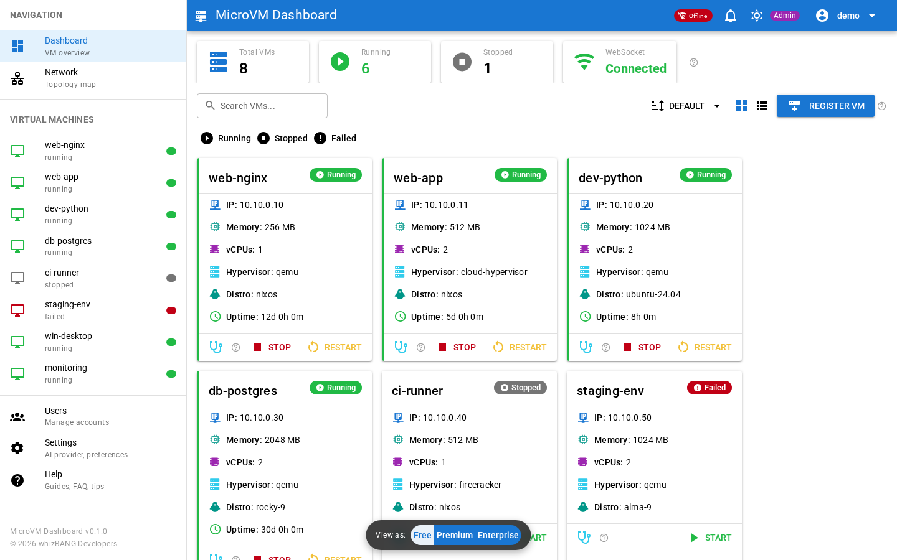

<!-- Copyright (c) 2026 whizBANG Developers LLC. All rights reserved. -->
<!-- Licensed under AGPL-3.0 (Free) or BSL-1.1 (Solo/Team/Fabrick) with AI Training Restriction. See LICENSE. -->
# Weaver


> **The definitive NixOS MicroVM management tool.** Monitor, control, and provision MicroVMs from a modern web interface -- no terminal required.

[-blue.svg)](LICENSE)
[](https://quasar.dev)
[](https://vuejs.org)
[](https://www.typescriptlang.org)
[](https://fastify.dev)
[](https://nixos.org)
[](https://securityscorecards.dev/viewer/?uri=github.com/whizbangdevelopers-org/Weaver-Free)


---

## Why Weaver?

Managing [microvm.nix](https://github.com/astro/microvm.nix) VMs through `systemctl` and `journalctl` works, but it doesn't scale. Weaver gives you:

- **Instant visibility** -- WebSocket-driven live status updates every 2 seconds. Start a VM from the terminal, watch the card flip green in the browser.
- **One-click lifecycle** -- Start, stop, restart any MicroVM without touching a terminal.
- **Declarative, reproducible deployment** -- A single NixOS module option. `services.weaver.enable = true;` and you're done.
- **AI-powered diagnostics** -- Ask Claude to diagnose, explain, or suggest fixes for any VM. Bring your own API key -- no vendor lock-in.
- **Multi-hypervisor provisioning** -- Create VMs from the browser with QEMU, Cloud Hypervisor, crosvm, kvmtool, or Firecracker.
- **NixOS-native** -- Purpose-built for NixOS. Manages `microvm@<name>.service` units directly with restricted sudo. No agents, no shims.

## Live Demo

Try the full dashboard without installing anything:

**[weaver-demo.github.io](https://weaver-demo.github.io)**

Eight sample VMs across multiple distros (NixOS, Ubuntu, Rocky, Alma, Windows), multiple hypervisors, and all status types. Use the **tier-switcher toolbar** to toggle between Free, Weaver, and Fabrick feature sets in real time.



## Install

### NixOS Module (recommended)

Add to your flake and rebuild:

```nix
# flake.nix
{
  inputs.weaver.url = "github:whizbangdevelopers-org/Weaver-Free";

  outputs = { nixpkgs, weaver, ... }: {
    nixosConfigurations.myhost = nixpkgs.lib.nixosSystem {
      modules = [
        weaver.nixosModules.default
        {
          services.weaver = {
            enable = true;
            port = 3100;
            openFirewall = true;
          };
        }
      ];
    };
  };
}
```

```bash
sudo nixos-rebuild switch
```

Dashboard available at `http://<host>:3100`. On first visit, create an admin account through the web UI to get started. This initial setup is required before using any client (web or TUI).

> **First build note.** NixOS builds the dashboard from source on the first `nixos-rebuild`. Subsequent rebuilds are near-instant thanks to the Nix store cache.

For non-flake setups, bridge networking, secrets management, and advanced configuration, see the [NixOS platform guides](docs/platforms/nixos/).

### Docker

```bash
git clone https://github.com/whizbangdevelopers-org/Weaver-Free.git
cd Weaver
docker compose up -d
```

Access at `http://localhost:3110`. See [Docker guide](docs/platforms/docker/) for details.

### Development

```bash
git clone https://github.com/whizbangdevelopers-org/Weaver-Dev.git
cd Weaver-Dev
npm install && cd backend && npm install && cd ..
npm run dev:full    # Frontend :9010 + Backend :3110
```

## Compatibility

<!-- SYNC:COMPAT_SUMMARY:START -->
| Platform | Architecture | Provisioning | Status |
|----------|-------------|-------------|--------|
| NixOS 25.11+ bare metal | x86_64 | Full | Supported |
| NixOS 25.11+ VM (cloud/nested) | x86_64 | Nested virt required | Supported |
| NixOS 25.11+ bare metal | aarch64 | Experimental | Community |
| Docker (any Linux) | x86_64 | Dashboard only | Supported |
| Docker (any Linux) | aarch64 | Dashboard only | Community |
<!-- SYNC:COMPAT_SUMMARY:END -->

MicroVM provisioning requires KVM (`/dev/kvm`) and CPU virtualization extensions (Intel VT-x or AMD-V). Device passthrough additionally requires IOMMU (VT-d / AMD-Vi) enabled in BIOS.

**[Full Compatibility Matrix](docs/COMPATIBILITY.md)** -- hardware requirements, BIOS configuration, cloud provider compatibility, and NixOS version support.

**Pre-flight check:** Run `./scripts/preflight-check.sh` before installing to verify hardware readiness.

## Features

### Free Tier

Everything you need to monitor and manage existing MicroVMs.

- **Real-time dashboard** -- WebSocket status cards with grid and compact list views
- **VM lifecycle** -- Start / Stop / Restart from the browser
- **VM scanning** -- Auto-discover `microvm@*.service` units on the host
- **VM detail view** -- Configuration, networking, provisioning logs, and AI analysis tabs
- **AI diagnostics (BYOK)** -- Bring your own API key for Claude-powered Diagnose, Explain, and Suggest actions (5 req/min)
- **Serial console** -- In-browser terminal via xterm.js with WebSocket-to-TCP proxy
- **Network topology** -- Auto-detected bridge visualization
- **In-app notifications** -- Event bell with history
- **Keyboard shortcuts** -- `?` help, `D` dashboard, `S` settings, `N` notifications
- **PWA** -- Installable progressive web app with mobile-optimized layout
- **Help system** -- Searchable help page, Getting Started wizard, contextual tooltips

### Weaver Solo / Weaver Team

Create and manage VMs, not just monitor them.

- **VM provisioning** -- Create VMs from the UI with cloud-init image pipeline
- **Multi-hypervisor** -- QEMU, Cloud Hypervisor, crosvm, kvmtool, Firecracker
- **Windows support** -- BYOISO with VNC install (IDE disk + e1000 networking, desktop mode)
- **Distribution catalog** -- 11 built-in distros + custom URL definitions with health monitoring
- **Host info strip** -- NixOS version, CPU topology, disk/RAM usage, network interfaces, live metrics
- **Bridge management** -- Create/delete managed bridges and IP pools
- **Push notifications** -- ntfy, email (SMTP), webhook (Slack/Discord/PagerDuty), Web Push
- **Resource alerts** -- Configurable CPU/memory thresholds
- **AI diagnostics** -- Server-stored API key, 10 req/min

### Fabrick

Fleet governance for production environments.

- **Per-VM access control** -- Fine-grained ACLs per user per VM
- **Audit log** -- Queryable API for all VM, user, and agent actions
- **User quotas** -- VM resource limits with enforcement
- **Bulk operations** -- Multi-select start/stop/restart across VMs
- **AI diagnostics** -- 30 req/min
- **Priority support**

---

## Architecture

```
┌───────────────────────────────────────────────────────────┐
│                    BROWSER (PWA)                           │
│  ┌──────────────────────┐  ┌───────────────────────────┐  │
│  │  Quasar / Vue 3      │  │  WebSocket Client         │  │
│  │  Dashboard + Detail   │  │  Real-time VM status      │  │
│  │  Pinia Stores         │  │  Agent streaming          │  │
│  │  Tier-aware UI        │  │  Auto-reconnect           │  │
│  └──────────┬───────────┘  └──────────┬────────────────┘  │
└─────────────┼──────────────────────────┼──────────────────┘
              │ REST API                 │ WebSocket
┌─────────────┴──────────────────────────┴──────────────────┐
│                  FASTIFY BACKEND (:3100)                    │
│  ┌──────────────────────┐  ┌───────────────────────────┐  │
│  │  /api/workload routes      │  │  /ws/status broadcast     │  │
│  │  /api/users, /audit   │  │  2-second interval        │  │
│  │  /api/agent           │  │  Agent token streaming    │  │
│  │  Zod validation       │  │                           │  │
│  │  JWT auth + RBAC      │  │                           │  │
│  │  Tier gating          │  │                           │  │
│  └──────────┬───────────┘  └──────────┬────────────────┘  │
└─────────────┼──────────────────────────┼──────────────────┘
              │ systemctl                │ systemctl
┌─────────────┴──────────────────────────┴──────────────────┐
│                     NIXOS HOST                             │
│  microvm@web-nginx.service    (QEMU, 256 MB, 10.10.0.10)  │
│  microvm@web-app.service      (Cloud HV, 512 MB)          │
│  microvm@dev-node.service     (QEMU, 512 MB)              │
│  microvm@ci-runner.service    (Firecracker, 256 MB)        │
│  ...                                                       │
└────────────────────────────────────────────────────────────┘
```

## Network

The dashboard uses a dedicated bridge for VM communication. Defaults work out of the box:

| Setting | Default | Description |
| ------- | ------- | ----------- |
| Bridge interface | `br-microvm` | Linux bridge connecting host to VMs |
| Bridge gateway | `10.10.0.1` | Host IP on the bridge |
| VM subnet | `10.10.0.0/24` | Usable range: `.2` -- `.254` |

Override in your NixOS config if the default subnet conflicts with your network. See [SETUP-COMMON.md](docs/platforms/nixos/SETUP-COMMON.md) for bridge configuration details.

## Tech Stack

| Layer | Technology | Version |
| ---------- | --------------------- | ------- |
| UI Framework | [Quasar](https://quasar.dev) | 2.14+ |
| Frontend | [Vue 3](https://vuejs.org) | 3.5+ |
| Language | [TypeScript](https://typescriptlang.org) | 5.3+ |
| Backend | [Fastify](https://fastify.dev) | 4.x |
| State | [Pinia](https://pinia.vuejs.org) | 2.1+ |
| Validation | [Zod](https://zod.dev) | 3.x |
| Console | [xterm.js](https://xtermjs.org) | 6.x |
| Testing | Vitest / Playwright | -- |
| Platform | [NixOS](https://nixos.org) | 25.11+ |

## Security

Weaver manages VM lifecycle operations on NixOS hosts. Security is not an afterthought:

- **Least privilege** -- Dedicated `weaver` system user with sudo restricted to `microvm@*.service` commands only
- **Input validation** -- All API parameters validated with Zod schemas. VM names restricted to `^[a-z][a-z0-9-]*$`
- **JWT authentication** -- 30-minute access tokens, 7-day refresh tokens, bcrypt cost 13 (OWASP 2024+)
- **Account lockout** -- 5 attempts / 15 minutes, persisted to disk (survives restarts)
- **RBAC** -- Admin / Operator / Viewer roles with backend enforcement
- **Secrets management** -- JWT secret required in production, integrates with sops-nix
- **Supply chain** -- All 40 GitHub Actions SHA-pinned across 10 workflows

See [SECURITY.md](SECURITY.md) for the full security policy and vulnerability reporting.

## Software Quality

Weaver is tested to enterprise standards from day one:

| Dimension | Our Approach | Industry Standard | Rating |
|-----------|--------------|-------------------|--------|
| Test coverage | 1,300+ tests across 4 layers (unit, backend, TUI, E2E) | Wide base, narrow top | A |
| Static analysis | 13 custom auditors (forms, routes, SAST, tier parity, license, bundle, doc freshness) + lint + typecheck | 1–2 generic tools (lint + type) | A+ |
| E2E isolation | Docker-containerized, seed data, pre-auth, 5 browsers | Docker or CI-managed | A |
| Tier enforcement | Machine-readable feature matrix + bidirectional code scanning | Manual review or none | A+ |
| Gate enforcement | Git hooks + GitHub Actions CI on every push | CI blocks merge | A |
| Security testing | Custom SAST + supply chain SHA pinning + license audit + OWASP patterns | npm audit or Snyk | A |
| Reproducibility | Deterministic Docker E2E + `.nvmrc` + lockfile verification | Hermetic CI containers | A |
| **Overall** | | | **A** |

Full benchmark: [docs/TESTING-ASSESSMENT.md](docs/TESTING-ASSESSMENT.md) — scored against enterprise standards.

## Terminal UI (TUI)

A companion terminal client for headless servers and SSH sessions:

```bash
npx weaver-tui --url http://localhost:3100
```

VM list, detail views, and status monitoring from the terminal. Supports `--demo` mode for offline use.

> **Prerequisite:** The TUI connects to the same backend API as the web UI. You must complete the initial admin setup via the web interface (`http://<host>:3100`) before the TUI can authenticate.

> **Psst.** The Help page in the web UI knows things about the TUI that this README doesn't. Go find them.

## Documentation

| Document | Description |
| --- | --- |
| [NixOS Setup](docs/platforms/nixos/) | Flake and traditional NixOS deployment |
| [Docker Setup](docs/platforms/docker/) | Container-based deployment |
| [Production Deployment](docs/PRODUCTION-DEPLOYMENT.md) | Security checklist, monitoring, backup |
| [Developer Guide](docs/DEVELOPER-GUIDE.md) | Architecture, API reference, contributing |
| [Testing](TESTING.md) | Unit, E2E, and security test suites |
| [Changelog](CHANGELOG.md) | Version history |
| [Compatibility Matrix](docs/COMPATIBILITY.md) | Hardware, platform, and BIOS requirements |
| [Security Policy](SECURITY.md) | Vulnerability reporting |

## Contributing

We welcome contributions. See [CONTRIBUTING.md](CONTRIBUTING.md) for guidelines.

Before submitting a PR:
```bash
npm run test:precommit   # lint + typecheck + unit tests
```

E2E tests run in Docker:
```bash
cd testing/e2e-docker && ./scripts/run-tests.sh
```

## Attributions

Built on excellent open-source projects:

| Project | Use | License |
|---------|-----|---------|
| [Quasar Framework](https://quasar.dev) | UI component library | MIT |
| [Vue.js](https://vuejs.org) | Frontend framework | MIT |
| [Fastify](https://fastify.dev) | Backend HTTP server | MIT |
| [Pinia](https://pinia.vuejs.org) | State management | MIT |
| [Zod](https://zod.dev) | Schema validation | MIT |
| [xterm.js](https://xtermjs.org) | Terminal emulator | MIT |
| [microvm.nix](https://github.com/astro/microvm.nix) | NixOS MicroVM framework | MIT |
| [Vitest](https://vitest.dev) | Unit testing | MIT |
| [Playwright](https://playwright.dev) | E2E testing | Apache-2.0 |
| [Material Design Icons](https://pictogrammers.com/library/mdi/) | Icon set | Apache-2.0 |

Special thanks to the [NixOS](https://nixos.org) community and [Astro](https://github.com/astro) for making declarative VM management possible.

## License

**Weaver Free** is licensed under AGPL-3.0 with Commons Clause and AI Training Restriction. See [LICENSE](LICENSE).

**Weaver Solo, Weaver Team, and Fabrick** are licensed under BSL-1.1 (Business Source License 1.1). See [LICENSE-PAID-DRAFT](docs/legal/LICENSE-PAID-DRAFT.md).

The Free tier code is source-available and free to use, modify, and self-host. The restrictions prevent AI model training on this codebase and commercial resale of the software itself. If you're running it on your NixOS box, you're good. Paid tiers convert to AGPL-3.0 four years after each release.

---

Built with [Quasar Framework](https://quasar.dev) and [Fastify](https://fastify.dev). Part of the [WhizBang Developers LLC](https://github.com/whizbangdevelopers-org) ecosystem.
