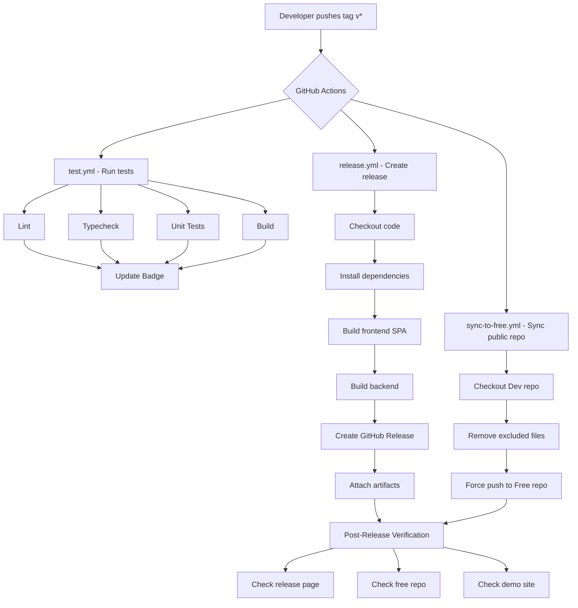

<!-- Copyright (c) 2026 whizBANG Developers LLC. All rights reserved. -->
<!-- Licensed under AGPL-3.0 (Free) or BSL-1.1 (Solo/Team/Fabrick) with AI Training Restriction. See LICENSE. -->
# Release Workflow

Detailed documentation of the Weaver release pipeline, including automation, sequencing, and troubleshooting.

## Release Pipeline Overview



## Step-by-Step Release Process

### Phase 1: Preparation

```bash
# Ensure main is clean and up to date
git checkout main
git pull origin main
git status  # Should be clean

# Run full test suite
npm run test:prepush

# Build all targets
npm run build:all
```

### Phase 2: Version and Changelog

```bash
# Update version in both package files
# Edit package.json: "version": "0.2.0"
# Edit backend/package.json: "version": "0.2.0"

# Update CHANGELOG.md
# Move [Unreleased] items to [0.2.0] - YYYY-MM-DD

# Commit version bump
git add package.json backend/package.json CHANGELOG.md
git commit -m "chore: release v0.2.0"
```

### Phase 3: Tag and Push

```bash
# Create annotated tag
git tag -a v0.2.0 -m "Release v0.2.0"

# Push commit and tag
git push origin main
git push origin v0.2.0
```

### Phase 4: Automated Workflows

Once the tag is pushed, GitHub Actions automatically runs:

1. **test.yml** -- Validates the tagged commit passes all checks.
2. **release.yml** -- Builds artifacts and creates a GitHub Release.
3. **sync-to-free.yml** -- Syncs the release to the public Free repo.

### Phase 5: Verification

After workflows complete (typically 3-5 minutes):

```bash
# Check release was created
gh release view v0.2.0

# Check free repo was synced
gh api repos/whizbangdevelopers-org/Weaver-Free/commits/main --jq '.sha'

# Compare with dev repo
git rev-parse HEAD
```

## Workflow Details

### release.yml

**Trigger:** Push of tags matching `v*`.

```yaml
on:
  push:
    tags:
      - 'v*'
```

**Job sequence:**

1. Checkout the tagged commit.
2. Set up Node.js environment.
3. Install npm dependencies (root and backend).
4. Build the frontend SPA (`npm run build`).
5. Build the backend (`npm run build:backend`).
6. Create a GitHub Release with auto-generated notes.
7. Upload the `dist/` directory as a release artifact.

### sync-to-free.yml

**Trigger:** Push of tags matching `v*`, or manual workflow dispatch.

**Job sequence:**

1. Checkout the Dev repo at the tagged commit.
2. Remove excluded files and directories:
   - `CLAUDE.md`
   - `.github/workflows/sync-to-free.yml`
   - `docs/planning/`
   - `docs/workflows/CLAUDEMD-GENERATOR-PROMPT.md`
   - `docs/setup/MCP-TOOLING-SETUP.md`
3. Configure git with the `FREE_REPO_TOKEN`.
4. Force-push to the Free repo's `main` branch.

## Manual Release (Fallback)

If automated workflows fail, create a release manually:

```bash
# Build locally
npm run build:all

# Create GitHub Release
gh release create v0.2.0 \
  --title "v0.2.0" \
  --notes-file CHANGELOG.md \
  dist/spa/**

# Manual sync to free repo
git clone https://github.com/whizbangdevelopers-org/Weaver-Free.git /tmp/free
cp -r . /tmp/free/ --exclude=.git
rm -rf /tmp/free/CLAUDE.md /tmp/free/docs/planning
cd /tmp/free
git add -A && git commit -m "Sync v0.2.0" && git push
```

## Troubleshooting

### release.yml fails at build step

**Symptom:** The build step fails with compilation errors.

**Cause:** The tagged commit has a build issue that was not caught locally.

**Fix:**
1. Check the workflow logs for the specific error.
2. Fix the issue on `main`.
3. Delete the bad tag: `git tag -d v0.2.0 && git push origin :refs/tags/v0.2.0`
4. Delete the failed GitHub Release (if partially created).
5. Re-tag and push after the fix.

### sync-to-free.yml fails with authentication error

**Symptom:** `git push` to the Free repo fails with 401 or 403.

**Cause:** The `FREE_REPO_TOKEN` has expired or lacks permissions.

**Fix:**
1. Generate a new PAT with `repo` scope.
2. Update the `FREE_REPO_TOKEN` secret in repository settings.
3. Re-run the workflow: `gh workflow run sync-to-free.yml`.

### Release created but artifacts missing

**Symptom:** The GitHub Release exists but has no attached files.

**Cause:** The artifact upload step failed, possibly due to path issues.

**Fix:**
1. Build locally: `npm run build:all`.
2. Manually upload artifacts: `gh release upload v0.2.0 dist/spa/index.html`.
3. Or delete and recreate the release with the correct artifacts.

### Free repo is out of sync

**Symptom:** The Free repo does not match the Dev repo after a release.

**Fix:**
```bash
# Trigger manual sync
gh workflow run sync-to-free.yml --ref v0.2.0
```

### Demo site not updating

**Symptom:** The demo site still shows the old version after release.

**Fix:**
1. Check if the demo deployment workflow ran.
2. Verify GitHub Pages is deploying from the correct branch.
3. Clear browser cache (GitHub Pages has aggressive caching).
4. Manual deploy if needed (see `demo/DEMO-README.md`).

## Release Cadence

| Release Type | Frequency | Examples |
| ------------ | --------- | -------- |
| Patch (bugfix) | As needed | v0.1.1, v0.1.2 |
| Minor (feature) | Every 2-4 weeks | v0.2.0, v0.3.0 |
| Major (breaking) | As needed | v1.0.0 |

There is no fixed release schedule. Releases are cut when there are meaningful changes to ship.
